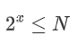
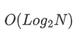
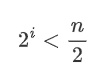
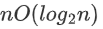

# 练习

**1.以下算法时间复杂度为：**

```c++
void fun(const int n) {
    int i = 1;
    while (i <= n) {
        i = i*2;
    }
}
```

这里主要是算出<font color='red'>“i = i*2;”</font>语句的执行次数和n规模之间的关系。

通过计算等比数列求和公式知：



其中x是运行次数。x即为所求的算法复杂度。所以算法复杂度为：



**2.求以下算法时间复杂度：**

```c++
x = 2;
while(x < n/2)
{
    x=2*x;
}
```

循环语句<font color='red'>x=2*x;</font>执行次数i和n规模的关系为:



所以算法复杂度为：


**3.求整数n的阶乘的算法如下，计算时间复杂度：**

```c++
int fact(int n)
{
    if(n <= 1){
      return 1;  
    } 
    return n*fact(n-1);
}
```

这是个递归方法计算n的阶乘。显然一共调用fact函数n次，故其算法时间复杂度为O(n);

**4.下列程序段的时间复杂度是？**

```c++
count = 0;
for(k = 1; k <= n;k *= 2)
	for(j = 1; j <= n; j++)
        count++;
```

第一层for循环执行了次，第二层for循环每次执行n次，故算法时间复杂度为：

