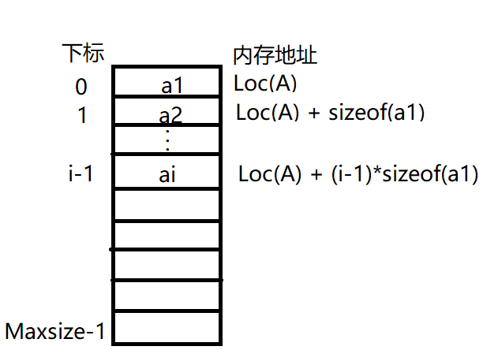

# 2.2 线性表的顺序表示

## 2.2.1 顺序表的定义

线性表的顺序存储叫顺序表。它是一组地址连续的存储单元依次存储线性表中的数据元素，从而使得逻辑上相邻的两个元素在物理位置上也相邻。特点是表中元素的逻辑顺序与其物理顺序相同。



​	每个数据元素的存储位置都和线性表的起始位置相差一个和该数据元素的位序成正比的常数，因此，线性表中的任一数据元素都可以随机存取，所以线性表的顺序存储结构是一种随机存取的存储结构。在c++语言中表现为数组。

用c++描述一个顺序表：

```c++
 #include <iostream>
// #include "Sales_item.h"

using namespace std;

template<class t>
class SqList{
private:
    t* arr;      // 动态分配，当插入溢出时，方便扩容
    unsigned int Maxsize; // 最大个数
    unsigned int length;  // 当前个数

public:
    SqList(unsigned int size = 1024);
    ~SqList();
    // ... 这里待加入增删改查
};

template<class t>
SqList<t>::SqList(unsigned int size)
{
    Maxsize = size;

    // 顺序表的最小容纳个数为10个
    if (Maxsize < 10)
    {
        Maxsize = 10;
    }

    arr = new t[size];
    length = 0;
}

template<class t>
SqList<t>::~SqList()
{
    delete arr;
    arr = nullptr;
}
```

此处实现采用动态分配数组，是为了应对当插入新的数据时若数组已满，则可以通过动态的扩容，使得插入成功。

顺序表的特点主要是可以随机访问，即通过首地址和元素序号可在时间O(1)内找到指定的元素，这是因为电脑的硬件设计支持这么做。顺序表的存储密度高，每个结点只存储数据元素。顺序表逻辑上相邻的元素物理上也相邻，所以插入和删除操作需要移动大量的元素，消耗大。

## 2.2.2 顺序表基本操作的实现

### 插入操作

​	在顺序表L的第i个位置插入新元素e。如i不合法，则返回false，插入失败。否则，将第i个元素及其后的所有元素依次往后移动一个位置，腾出一个空位置插入新元素e，表长+1，返回true。

```c++
/// <summary>
/// 插入数据
/// </summary>
/// <typeparam name="t">类型</typeparam>
/// <param name="index">插入位置</param>
/// <param name="e">新插入的元素</param>
/// <returns>插入成功结果</returns>
template<class t>
bool SqList<t>::ListInsert(unsigned int index, t e)
{
    if (index < 1 || index > length + 1)    // 插入位置超出链表所在位置
    {
        return false;
    }
    
    if (length >= Maxsize)   // 当前数组满了，扩容
    {
        Maxsize = Maxsize * 2; // 扩容为原来的两倍
        t* temp = arr;
        arr = new t[Maxsize];
        for (unsigned int i = 0; i < length; i++)    // 将原数组数据拷贝到新的数组中
        {
            arr[i] = temp[i];            
        }

        delete temp;    // 删除原数组空间
        temp = nullptr;
    }
    for (unsigned int j = length; j >= index; j--)
    {
        arr[j] = arr[j - 1]; // 数据后移
    }

    arr[index - 1] = e;     // 插入新元素
    length++;               // 表长加一
    return true;
}
```

### 删除操作

删除顺序表L中第i个位置的元素，用引用变量e返回。如i不合法，则返回false，删除失败。否则，将第i+1个元素及其后的所有元素依次往前移动一个位置，表长-1，返回true。

```c++
template<class t>
bool SqList<t>::ListDelete(unsigned int index, t& e)
{
    if (index<1 && index >length)    // 判断index有效性
    {
        return false;
    }
    
    e = arr[index - 1]; // 读取第index个数据元素
    for (unsigned int i = index; i < length; i++) // 第index后的数据元素往前移动
    {
        arr[i - 1] = arr[i];
    }
    
    length--;   // 表长减一
    return true;
}
```

### 按值查找

```c++
/// <summary>
/// 按值查找值等于e的元素的位置
/// </summary>
/// <param name="e">待查找值</param>
/// <returns>值为e的元素在顺序表中的位置；返回0表示返回失败</returns>
template<class t>
unsigned int SqList<t>::LocateElem(t e)
{
    for (unsigned int i = 0; i < length; i++)
    {
        if (arr[i] == e)
        {
            return i + 1;
        }
    }

    return 0;   // 返回0表示查找失败
}
```

### 按位查找

```c++
/// <summary>
/// 按位取值
/// </summary>
/// <param name="index">第几个元素，输入0和输入超过表长的数将会抛出异常。</param>
/// <returns>返回表中第index位数据元素的副本</returns>
template<class t>
t SqList<t>::GetElem(unsigned int index) 
{
    if (index < 1 || index > length + 1)
    {
        std::cout << "out of range in SqList" << std::endl;
        throw exception ex;
    }

    t e = arr[index - 1];
    return e;
}
```

### 获取表长

```c++
template<class t>
unsigned int SqList<t>::GetLength() 
{
    return length;
}
```

### 判空

```c++
template<class t>
bool SqList<t>::Empty()
{
    return length == 0;
}
```

## 2.2.3 练习题目

### 题目一 ：倒置数组

**设将n(n>1)个整数存放到一维数组R中。设计一个在时间和空间两方面都尽可能高效的算法。将R中保存的序列循环左移p(0<p<n)个位置，即将R中的数据由(0，1，…，p，p+1，n-1)变换为(p，p+1，…，n-1，0，1，…，p-1)。给出算法的基本设计思想。说明算法时间复杂度和空间复杂度。**

设计思路：

1）创建一个大小为p的一维数组temp，将从下标从0到p-1的数据元素保存到赋值数组temp中。

2）将R中下标为p到n-1的数据元素左移p个位置。

3）将辅助数组temp中的数据依次拷贝到R中下标为n-p到n-1位置中。

代码以int数组为示例。

```c++
/// <summary>
/// 在位置pos处倒置
/// </summary>
/// <param name="arr">数组地址</param>
/// <param name="len">数组长度</param>
/// <param name="pos">倒置的位置p</param>
void Reverse(int arr[], int len, int pos)
{
    if (pos <= 0 || pos >= len) // 保证 0<p<n
        return;

    int* temp = new int[pos];   // 辅助数组
    
    // 将下标0到pos-1的数组元素备份
    for (int i = 0; i < pos; i++)
    {
        temp[i] = arr[i];
    }

    // 下标 pos 到数组尾部数据左移pos个单位
    for (int j = 0; j < len - pos; j++)
    {
        arr[j] = arr[pos + j];
    }

    // 将辅助数组的数据拷贝回去
    for (int k = 0; k < pos; k++)
    {
        arr[len - pos + k] = temp[k];
    }

    delete [] temp;    // 释放辅助数组
    temp = nullptr;
}

// 主函数调用
int arr[10] = { 0,1,2,3,4,5,6,7,8,9 };
Reverse(arr, 10, 6);
```

时间复杂度为O(n)；空间复杂度为O(p)。

另外一种解法是：

1）先倒置R中下标0到p-1的元素，倒置后序列为：（p-1，…，1,0，p，…，n-1）。

2）倒置R中下标p到n-1的元素，倒置后序列为：（p-1，…，1,0，n-1，…，p）。

3）倒置R中下标0到n-1的元素，倒置后序列为：（p，…，n-1，0，1，…，p-1）。

```c++
/// <summary>
/// 倒置数组
/// </summary>
/// <param name="arr">数组地址</param>
/// <param name="from">倒置起始下标</param>
/// <param name="to">倒置末尾下标</param>
void Reverse2(int arr[], int from, int to)
{
    int count = (to - from + 1) / 2;    // 循环次数
    for (int i = 0; i < count; i++)
    {
        int temp = arr[from + i];
        arr[from + i] = arr[to - i];
        arr[to - i] = temp;
    }
}

// 主函数调用
int arr[10] = { 0,1,2,3,4,5,6,7,8,9 };
Reverse2(arr, 0, 6-1);
Reverse2(arr, 6, 9);
Reverse2(arr, 0, 9);
```

时间复杂度为O(n)；空间复杂度为O(1)。

### 题目二：中位数

一个长度为L（L≥1）的生序序列S，处在第⌈L/2⌉个位置的数称为S的中位数。列如，若序列S1=(11,13,15,17,19)，则S1中的中位数是15，两个序列的中位数是含它们所有元素的生序序列的中位数。列如，若S2=(2,4,6,8,20)，则S1和S2的中位数是11。现在有两个等长升序序列A和B，试设计一个在时间和空间算法两方面都尽可能高效的算法，找出A和B的中位数。要求：给出算法设计的基本思路。说明算法时间复杂度和空间复杂度。

设计思路：

分别求两个升序序列A、B的中位数，设为a和b，求序列A、B的中位数过程如下：

① 若a=b，则a或b即为所求中位数，程序结束。

②若a<b，则舍弃序列A中较小的一半，同时舍弃序列B中较大的一半，要求两次舍弃的长度相等。

③若a>b，则舍弃序列A中较大的一半，同时舍弃序列B中较小的一半，要求两次舍弃的长度相等。

在保留的两个升序序列中，重复过程①②③，直到两个序列中均只有一个元素为止，较小者即为所求的中位数。

```c++
int M_Search(int a[], int b[], int len)
{
    int aBegin = 0, aEnd = len - 1, bBegin = 0, bEnd = len - 1;
    int aMin = (aBegin + aEnd) / 2, bMin = (bBegin + bEnd) / 2;   // aMin是a数组的中位数下标，bMin是b数组的中位数下标 
    while ((aBegin != aEnd || bBegin != bEnd))
    {
        if (a[aMin] < b[bMin])
        {
            if ((aBegin + aEnd) % 2 == 0) { // 元素个数为寄数个
                aBegin = aMin;              // 舍弃序列A中间点以前部分，保留中间点
                bEnd = bMin;                // 舍弃序列B中间点后面部分，保留中间点
            }
            else {                          // 元素个数为偶数个
                aBegin = aMin + 1;          // 舍弃序列A中间点以前部分及中间点
                bEnd = bMin;                // 舍弃序列B中间点后面部分且保留中间点
            }
            
        }
        else if(a[aMin] > b[bMin])
        {
            if ((bBegin + bEnd) % 2 == 0)    // 元素个数为奇数个
            {
                aEnd = aMin;   // 舍弃序列A中间点后面部分，保留中间点 
                bBegin = bMin; // 舍弃序列B中间点以前部分，保留中间点
            }
            else{
                aEnd = aMin;   // 舍弃序列A中间点后面部分，保留中间点 
                bBegin = bMin + 1; // 舍弃序列B中间点以前部分，保留中间点
            }
            
        }
        else    // 中位数相等
        {
            return a[aMin];
        }
        aMin = (aBegin + aEnd) / 2, bMin = (bBegin + bEnd) / 2; // 计算新序列的中位数下标
    }

    return a[aMin] < b[bMin] ? a[aMin] : b[bMin];   // 当保留的序列只剩一个时，返回最小的那个数。
}
```

