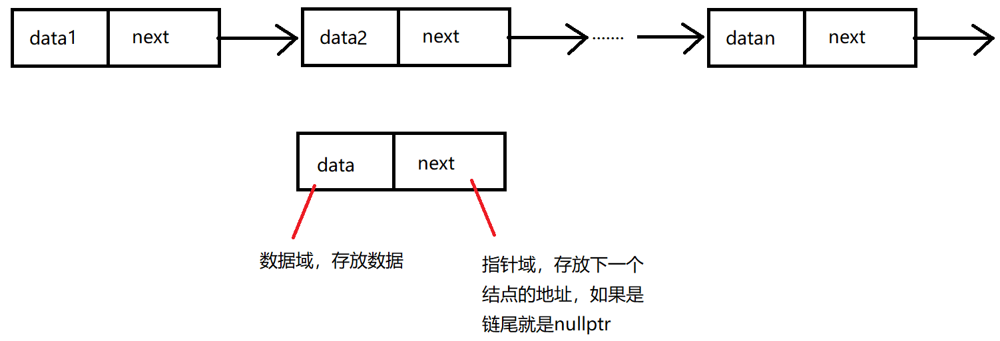
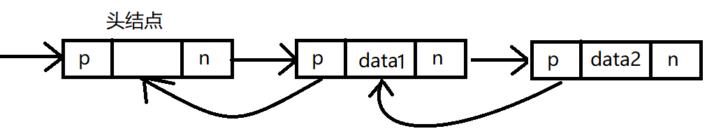

# 2.3 线性表的链式表示

​	顺序表可以随时存取表中的任一一个元素，它的存储位置可以用一个简单直观的公式表示，但是出入和删除操作需要移动大量元素。链式存储线性表时，不需要使用地址连续的存储单元。不要求逻辑上相邻的元素物理上位置也相邻。因此插入和删除操作不需要移动元素，只需要修改指针。但是查询只能沿着链一个一个查找，查询性能就降低了。

## 2.3.1 单链表的定义

线性表的链式存储又称单链表。

 

### 单链表结点代码结构

```c++
template<class t>
class LNode {
public:
    t data;         // 数据域
    LNode<t> *next;     // 指针域
    
public:
    LNode(t e):data(e), next(nullptr){}
};
```

​	单链表可以解决顺序表需要大量连续存储单元的缺点（数组并不需要为其下标开辟存储空间），但是单链表附加指针域，也存在浪费存储空间的缺点。单链表的元素离散分布在存储空间中，是非随机存取的存储结构。不能直接定位某个特定的结点，只能从表头沿着链域一个一个的遍历。

​	带头结点：通常用头指针来标识一个链表，如单链表L，头指针为NULL时表示一个空表。为了操作上的方便，在单链表第一个结点之前附加一个结点，称为头结点，结点的data不存数据。

### 链表结构

```c++
template<class t>
class LinkList {

private:
    LNode<t>* phead; // 头指针
    LNode<t>* ptail; // 尾指针

public:
    LinkList();	// 初始化
   	void Insert(t e);
    bool Insert(int i, t e);
    LNode<t>* GetElem(int i);  // 按序号查找结点
    LNode<t>* LocateElem(t e); // 按值查找结点
    bool Delete(int i); // 按序号删除结点
    size_t GetLength(); // 求表长
};


template<class t>
inline LinkList<t>::LinkList()
{
    // 创建头结点，结点不存内容。
    phead = new LNode<t>();
    ptail = phead;  // 尾指针指向头结点
}
```

## 2.3.2 单链表上基本操作的实现

### 插入操作

```c++
/// <summary>
/// 尾部插入新的结点
/// </summary>
/// <param name="e">数据</param>
template<class t>
void LinkList<t>::Insert(t e)
{
    // ptail 永远不为空，因为有头结点
    ptail = ptail->next;
    ptail = new LNode<t>();
    ptail->data = e;
    ptail->next = nullptr;
}
```

### 查找操作

#### 按序号查找结点值

​	在单链表中从第一个结点出发，顺着指针 next 域逐个往下搜索，直到找到第i个结点为止，否则返回最后一个结点指针域NULL。

```c++
template<class t>
inline LNode<t>* LinkList<t>::GetElem(int i)
{
    if (i < 1)  // i的值不能小于1
        return nullptr;

    int j = 1;
    LNode<t>* temp = phead->next;   // 获取将头指针的next
    
    // 沿着链找到对应位置的结点
    while (temp && j < i)
    {
        temp = temp->next;
        j++;
    }

    return temp;
}
```

#### 按值查找表结点

​	从单链表的第一个结点开始，由前往后依次比较表中各结点数据域的值，若某结点数据域的值等于给定值e，则返回该节点的指针；若整个单链表中没有这样的结点，则返回NULL。

```c++
template<class t>
inline LNode<t>* LinkList<t>::LocateElem(t e)
{
    LNode<t>* temp = phead->next;
    while (temp && temp != e)
    {
        temp = temp->next;
    }

    return temp;
}
```

### 插入新结点

​	插入结点操作将值为x的新结点插入到链表的第i个位置上。先检查插入位置的合法性，然后找到待插入位置的前驱结点，即第 `i-1` 个结点，再在其后插入新结点。

```c++
/// <summary>
/// 按位置插入法。
/// </summary>
/// <param name="i">插入的位置</param>
/// <param name="e">插入的结点数据</param>
/// <returns>true，插入成功；false，插入失败</returns>
template<class t>
inline bool LinkList<t>::Insert(int i, t e)
{
    if (i < 1)
        return false;
    LNode<t>* p = GetElem(i - 1);
    if (p)
        return false;
    LNode<t>* temp = new LNode<t>();
    temp->data = e;
    temp->next = p->next; // 原链表中第i个位置的元素，可能为空，由新元素的next指向
    
    p->next = temp;
    if (temp->next == nullptr) // temp的next是空指针，则temp是个尾部结点
        ptail = temp;
}
```

### 删除操作

​	删除结点操作是将单链表的第i个结点删除。先检查删除位置的合法性，后查找表中第 `i-1` 个结点，即被删结点的前驱结点，再将其删除。

```c++
template<class t>
inline bool LinkList<t>::Delete(int i)
{
    LNode<t>* p = GetElem(i - 1);   // 找到第i-1个位置结点
    if (p || p->next)    // 第i-1个位置的结点为空或者第i个位置结点为空，删除失败
    {
        return false;
    }
        
    LNode<t>* pnext = p->next;
    p->next = pnext->next;  // 将第i-1个结点的next域指向第i个结点的next域
    delete pnext;

    if (p->next == nullptr) // 删除的i结点时ptail，则需要修改ptail的指向
        ptail = p;
    return true;
}
```

### 求表长

​	求表长，不算头结点。

```c++
template<class t>
inline size_t LinkList<t>::GetLength()
{
    int len = 0;
    auto current = phead;   // 获取头指针
    while ( current && ptail != current)
    {
        len++;
        current = current->next;
    }
    return len;
}
```

## 2.3.3 双链表

​	单链表结点中，只有一个指向其后继的指针，使得单链表只能从头结点依次顺序地向后遍历。要访问某个结点的前驱结点（插入、删除操作时），只能从头再遍历，访问后继结点的时间复杂度为O(1)，访问前驱结点的时间复杂度为O(n)。

​	双链表结点中有两个指针 prior 和 next，分别指向其前驱结点和后继结点。

 

### 双链表结点代码结构

```c++
template<class t>
class LNode {
private :
    t data;          // 数据域
    LNode<t>* next;  // 后继结点的指针域
    LNode<t>* pre;   // 前继结点的指针域 
};
```

​	双链表在单链表道德结点中增加了一个指向其前驱的 prior 指针，因此双链表中的按值查找和按位查找的操作与单链表相同。不同的是在插入和删除操作上，需要额外对前继结点指针域进行操作。

### 双链表的插入操作

#### 尾部插入

```c++
// 在链表尾部插入新结点
template <class t>
void LinkList<t>::Insert(t e)
{
    LNode<t>* temp = new LNode<t>(e);
    temp->pre = ptail;	// 将新结点的前继指针指向原链表中的tail指向的结点
    ptail->next = temp;	// 将链表原结点的尾结点的next指针指向新插入的结点
    ptail = temp;		// 尾指针移到最后一个结点
}
```

#### 按序号插入

```c++
/// <summary>
/// 按位置插入法。
/// </summary>
/// <param name="i">插入的位置</param>
/// <param name="e">插入的结点数据</param>
/// <returns>true，插入成功；false，插入失败</returns>
bool LinkList<t>::Insert(int i, t e)
{
    if(i < 1)	// 序号不能小于1
        return false;
    // 找到第 i-1个位置的结点
    LNode<t>* pi = GetElem(i - 1);
    if(pi)	// 如果第i-1个结点不存在，插入失败，
        return false;
    
    LNode<t>* t = pi->next;	// 插入前第i个结点
    LNode<t>* temp = new LNode<t>(e);	// 申请新结点
    pi->next = temp;	// 将新结点插入链表
    temp->pre = pi;
    if(ptail == pi)	// 如果第i-1个结点时链表尾结点，则移动尾结点
    {
        ptail = temp;
    }
    else	// 第i-1个结点不是尾结点
    {
        t->pre = temp;
        temp->next = t;
    }
    
    return true;
}
```

### 删除结点

```c++
// 按位删除结点
template <class t>
void Delete(int i)
{
    LNode<t>* pi = GetElem(i - 1);	// 获取第i-1个结点
    if(!pi || !(pi-next))	//	第i-1个结点不存在或者第i个结点不存在，程序结束
        return;
    if(pi->next)
        LNode<t>* t = pi->next->next;	// t 指向第 i+1个结点
    delete pi->next;	// 释放第i个结点的空间
    if(t == nullptr)	// 删除后第i+1个结点不存在，那第i-1个结点就成为了尾结点，需要将尾指针移动到对应的位置
    {
        ptail = pi;
	}
    else	
    {
        pi->next = t;
        t->pre = pi;
    }
}
```