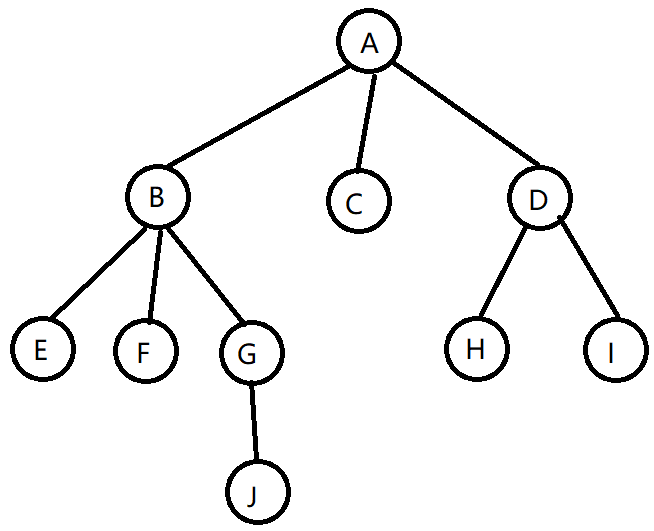

# 5.1 什么是树？

​	树是 n 个结点的有限集，n非负。当 n = 0 时，称为空树。任意非空树有以下特点：

* 有且仅有一个特定的称为根的结点。
* n > 1 时，其余结点可分为 m(m > 0)个互不相交的有限集T1，T2，......，Tm。其中每个集合本身又是一颗树，称为根的子树。
* 树的根结点没有前驱，除根结点外的所有结点有且只有一个前驱。
* 树中所有结点可以有零个或多个后继。

 

如上图所示：

 A 为 E、F、G、H、I、J 的**祖先**。E、F、G、H、I、J 是 A 的**子孙**。

A 是 B、C、D 的**双亲**，B、C、D 是 A 的**孩子**。

B、C、D是**兄弟**，H、I也是兄弟。

树中一个结点的孩子个数称为该结点的**度**。树中结点的最大度数称为**树的度**。A的度为3，C的度为0，D的度为2。

度大于0的结点称为**分支结点**。度为0的结点称为**叶子结点**。

结点的层次从树根开始定义，根结点第1层，它的子结点第2层，以此类推。上图的树为4层。双亲在同一层的结点称为**堂兄弟**。E、F、G、H、I 是堂兄弟。

结点的深度：从根结点往下数，每下一层就+1。

结点的高度：从当前结点网上数，没上去一层+1。

数的高度就是有几层。图中为4。

有序树：树结点的各子树从左到右有次序，不能互换，

路径：树的路径指祖先到孙子（双亲到孩子）的路径，堂兄弟或者远亲的路径不算。

路径长度：就是路径所含的边数。

森林：n 颗互不相交的树。