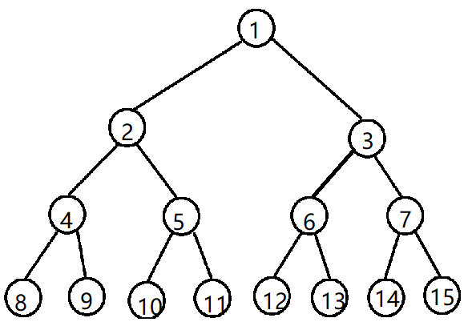
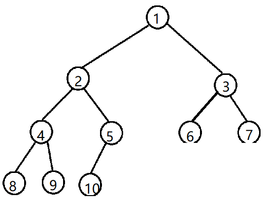
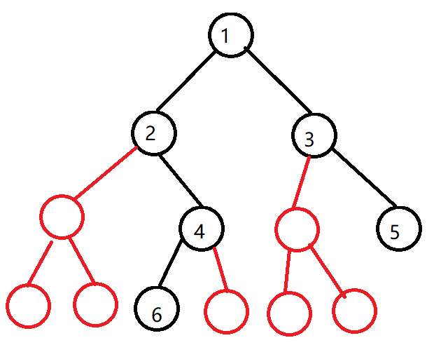
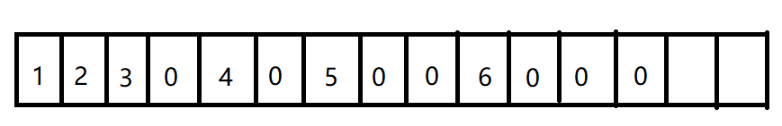
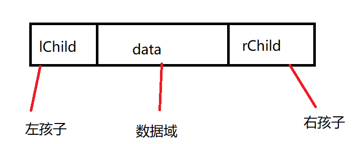
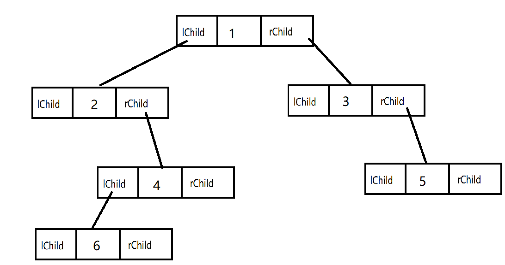

# 5.2 二叉树

每个结点至多只有两颗子树，有左右子树之分。如果某个结点的左右子树互换，那么就不是原来的树。

度为2的树，至少有3个结点，二叉树可以为空树。

二叉树就算某个结点只有一个孩子，也要区分左右孩子。

* **满二叉树**：一颗高度为 h，且含有（2的h次方-1）个结点的二叉树称为满二叉树。树中每层还有最多结点。满二叉树的叶子结点都集中在最下面一层，除叶子结点外，每个结点的度为2。

  

 

自上而下，自左向右，以1起始开始编号，对于编号为 i 的结点，若有双亲，双亲的编号为 i/2；

若有左孩子，左孩子编号为 2i。若有右孩子，右孩子编号为 2i+1。

* **完全二叉树**：高度为h、有 n个结点的二叉树，当且仅当其每个结点都与沟渎为h的满二叉树中编号为1-n的结点一一对应，称为完全二叉树。

   

完全二叉树的特征：

若 i ≤ n/2，则结点 i 为分支结点，否则为叶子结点。

叶子结点只可能在层次最大的两层上出现。对于最大层次的叶子结点，都依次排列在该层最左边的位置上。

若有度为1的结点，则只可能出现一个，且该结点只有左孩子没有右孩子。

按层序编号后，一旦出现某结点为叶子结点或只有左孩子，则编号大于该结点的结点均是叶子结点。

若n为奇数，则每个分支结点都有左孩子和右孩子；若n为偶数，则编号最大的分支结点只有左孩子，没有右孩子，其余分子结点左右孩子都有。

二叉排序树：左子树上的所有结点的关键字均小于根结点的关键字；右子树上的所有结点的关键字均大于根结点的关键字；左子树和右子树又各是一个二叉排序树。

平衡二叉树：树上任一结点的左子树和右子树的深度之差不超过1。

非空二叉树的叶子结点数等于度为2的结点树加1，即n0=n2+1。

结点数量为n，则边的数量为n-1。

非空二叉树的第k层上至多有2的（k-1）次方个结点。（k≥1）

高度为h的二叉树至多有2的h次方减1个结点。（h≥1）

### 顺序存储结构

顺序存储就是用一组连续地址来存储结点，在C++中就是数组。 

 

如上述两个图，红色的结点就是空结点，在数组中表示如下：

 

#### 那么怎么判断数组中各个结点之间的关系？

根据前文的双亲结点和左右孩子结点之间的关系，通过下标来管理。

### 链式存储

顺序存储多出了很多的空结点，对空间利用率低。二叉树一般采用链式存储，用链表结点表示二叉树中各个结点之间的关系。

 

同样的一棵树，链式存储如下：

 

代码结构：

```c++
template<class t>
class TreeNode
{
    t Data;							// 数据域
    TreeNode<t> *lChild, *rChild;	// 左右孩子
}
```

含有n个结点的二叉链表中，含有n+1的空指针域。