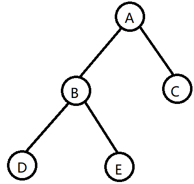

# 5.3 二叉树的遍历

​	二叉树的遍历是指按某条搜索路径访问树中每个结点，使得每个结点均被访问一次，且仅被访问一次。说白了，就是树是一种分叉结构，怎么想办法转换成线性结构。

概念：根结点N，左孩子L，右孩子R。

常见的遍历方法有**先序遍历NLR**，**中序遍历LNR**，**后序遍历LRN**。

 

如果是先序遍历的话，就是先访问根结点，再访问左孩子结点，再访问右孩子结点：ABDEC。

如果是中序遍历的话，就是先访问左孩子结点，再访问根结点，再访问右孩子结点：DBEAC。

如果是先序遍历的话，就是先访问左孩子结点，再访问右孩子结点，再访问根结点：DEBCA。

### 先序遍历

#### 递归实现

```c++
void PreOrder(TreeNode<t> root)
{
    if(root!=NULL)
    {
        visit(root);	// 直接访问当前结点
        PreOrder(root->lChile);	// 递归左子树
        PreOrder(root->rChild);	// 递归右子树
    }
}
```

#### 非递归实现

```c++
template <class t>
void PreOrder2(TreeNode<t>* root)
{
    std::stack<TreeNode<t>*> st;	// 辅助栈
    TreeNode<t>* current = root;
    while (current != NULL || !st.empty())	// 当前遍历指针不为空或者栈不为空，则执行遍历
    {
        if (current != NULL)
        {
            visit(current);
            st.push(current->rChild);	// 右孩子入栈
            current = current->lChild;	// 指向当前结点的左孩子
        }
        else {
            current = st.top(); 		// 出栈
            st.pop();
        }
    }
}
```

这里借助一个std域的栈类辅助。

### 中序遍历

#### 递归实现

```c++
void InOrder(TreeNode T)
{
    if(T!=NULL)
    {
        InOrder(T->lChile);	// 递归左子树
         visit(T);	// 直接访问当前结点
        InOrder(T->rChild);	// 递归右子树
    }
}
```

#### 非递归实现

```c++
template<class t>
void InOrder2(TreeNode<t>* root)
{
    std::stack<TreeNode<t>*> st;
    TreeNode<t>* current = root;
    
    while (current != nullptr || !st.empty())
    {
        if (current != nullptr) // 一直往左字符下沉
        {
            st.push(current);	// 下沉过程中把遇到的结点入栈
            current = current->lChild;
        }
        else
        {
            current = st.top();	// 出栈
            st.pop();
            visit(current);		// 访问结点
            current = current->rChild;	// 指向右子树
        }
    }
}
```


### 后序遍历

#### 递归实现

```c++
void PostOrder(TreeNode T)
{
    if(T!=NULL)
    {
        PostOrder(T->lChile);	// 递归左子树         
        PostOrder(T->rChild);	// 递归右子树
        visit(T);	// 直接访问当前结点
    }
}
```

递归实现的本质，其实是利用了语言本身断点栈的特点，而非递归是要我们自己额外申请一个栈，用于保存当前循环有哪些待访问的结点。

#### 非递归实现

```c++
template<class t>
void PostOrder(TreeNode<t>* root)
{
    std::stack<TreeNode<t>*> st;
    TreeNode<t>* current = root;
    TreeNode<t>* r = nullptr;   // 标记右子树是否被访问过

    while (current != nullptr || !st.empty())
    {
        if (current != nullptr) // 下沉至左边
        {
            st.push(current);
            current = current->lChild;
        }
        else {
            current = st.top(); // 查看栈顶元素
            if (current->rChild && current->rChild != r)    // 右子树存在且未访问过
            {
                current = current->rChild;
            }
            else {
                st.pop();
                visit(current);
                r = current;  // 记录最近访问过的点
                current = nullptr;  // 结点访问完后，重置指针
            }
        }
    }
}
```

### 层次遍历

利用队列来赋值遍历树的每个结点。

①从第一层开始，结点入队，执行完毕。

②队不为空，出队，并将出队的结点按左孩子先入队，再右孩子入队。

循环①②，直到队空。

```c++
// 层次遍历
template<class t>
void LevelOrder(TreeNode<t>* root)
{
    if (root == nullptr)
        return;

    queue<TreeNode<t>*> que;
    TreeNode<t>* current;   // 当前结点
    que.push(root);

    while (!que.empty()) // 队不为空，执行循环
    {
        // 队头元素出队
        current = que.front();
        que.pop();

        visit(current);

        if (current->lChild)    // 左孩子不为空，左孩子入队
            que.push(current->lChild);

        if (current->rChild)    // 右孩子不为空，右孩子入队
            que.push(current->rChild);
    }
}
```

