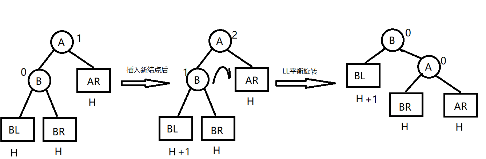
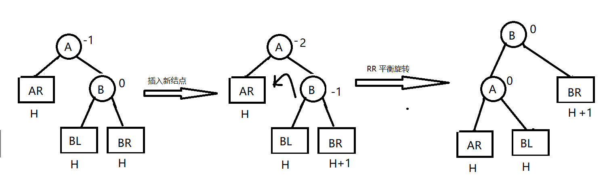
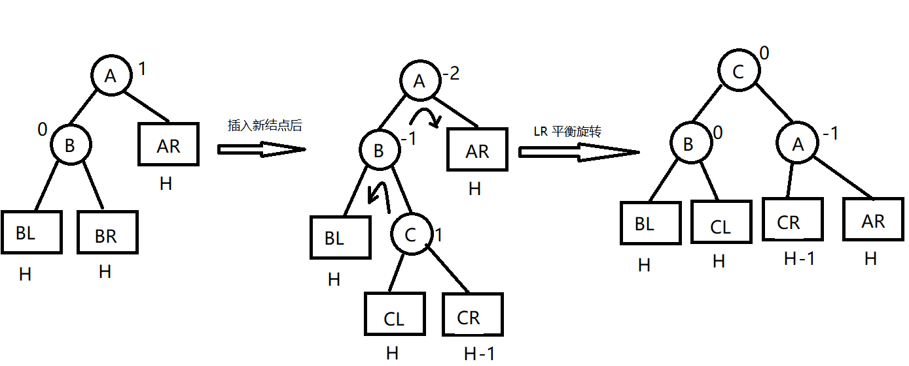

# 5.5 树和二叉树的应用

## 5.5.1 二叉排序树（BST）

### 定义

二叉排序树，也叫二叉查找时，二叉搜索树，可以是一颗空树。具有以下特征：

* 若左子树非空，则左子树上所有结点的值均小于根结点的值。
* 若右子树非空，则右子树上的所有结点的值均大于根结点的值。
* 左右子树也分别是一颗二叉排序树。

对其进行中序遍历，变得到一个有序的序列。

 

对上图进行中序遍历就是： 1 2 3 4 5 6

### 二叉排序树的查找

比如查找 3，根据上面定义的规则，从树根开始查找，先和根结点进行比较，发现数据 3 比 4 小，则移动指针下沉到根结点的左孩子，然后和数据为 2的结点进行比较，发现，3 比 2 大，所以结点数据为 2 的结点下沉到其右孩子，和 3 比较，发现相等，这样就找到了。

代码实现：

```c++
// 二叉搜索树的搜索方式
template<class t>
TreeNode<t>* search_key(TreeNode<t>* root, t key)
{
    TreeNode<t>* current = root;
    while (current && current->Data != key)
    {
        if (current->Data > key)
            current = current->rChild;
        else
            current = current->lChild;
    }

    return current;
}
```

### 二叉排序树的插入

```c++
template<class t>
TreeNode<t>* search_father(TreeNode<t>* root, t key)
{
    TreeNode<t>* father = nullptr;
    TreeNode<t>* current = root;
    while (current && current->Data != key)
    {
        if (current->Data < key)
        {
            father = current;
            current = current->rChild;
        }
        else
        {
            father = current;
            current = current->lChild;
        }
    }

    return father;
}

template<class t>
int GetChildrenNum(TreeNode<t>* root)
{
    if (root->lChild && root->rChild) // 左右孩子都存在
        return 2;

    if (root->lChild == nullptr && root->rChild == nullptr) // 叶子结点
        return 0;
    
    return 1;
}

// 中序遍历中查找当前结点的后继结点
template<class t>
TreeNode<t>* FindInOrderNext(TreeNode<t>* current)
{
    // 中序遍历的结点的后继肯定在右子树
    TreeNode<t>* exist = current->rChild;
    if (exist == nullptr)   // 没有后继
        return nullptr;

     TreeNode<t>* next = nullptr; // 指向后继结点
    while (exist)
    {
        if (exist)  // 一路向左
        {
            next = exist;
            exist = exist->lChild;
        }
        else {
            return next;
        }
    }

    return next;
}

// 二叉树的删除
template<class t>
void Delete(TreeNode<t>* root, t key)
{
    TreeNode<t>* father = nullptr;
    TreeNode<t>* current = search_key(root, key);   // 找到 key 结点
    
    if (!current)    // 为空，直接返回
        return;

    father = search_father(root, key);
    while (current != nullptr)
    {
        int count = GetChildrenNum(current);

        // 叶子结点直接删除
        if (count == 0)
        {
            if (father) {
                if (father->lChild == current) {
                    father->lChild = nullptr;
                }
                else {
                    father->rChild = nullptr;
                }
            }
           
            delete current;
            current = nullptr;
            return;
        }
        else if (count == 1)    // 只有一个孩子
        {
            auto child = current->lChild ? current->lChild : current->rChild;   // 获取删除结点的孩子
            father = search_father(root, current->Data);

            if (father->lChild == current)
                father->lChild = child;
            else
                father->rChild = child;

            delete current;
            current = nullptr;
            return;
        }
        else // 两个孩子都存在
        {
            TreeNode<t>* next = FindInOrderNext(current);
            
            // 找到父亲节点
            father = search_father(root, next->Data);

            if(next)
                current->Data = next->Data;
            
            current = next; // 将后继结点继续做判断
        } 
    }
}
```

貌似有问题，比如不能删除根结点，正确的做法是应该利用线索化二叉树来做。

## 5.5.2 平衡二叉树

### 定义

​	为避免树的高度增长过快，降低二叉排序树的性能，规定在插入和删除二叉树结点时，要保证任意结点的左、右子树高度差的绝对值不超过1，称为平衡二叉树。（BBT）

平衡因子：左子树和右子树的高度差。

### 平衡二叉树的插入

二叉排序树保证平衡的基本思想如下：每当在二叉排序树中插入（或删除）一个结点时，首先检查其插入路径上的结点是否因为此操作而导致了不平衡。若导致不平衡，则先找到插入路径上离插入结点最近的平衡因子的绝对值大于1的结点A，再对以A为根的子树，在保证二叉排序树特性的前提下，调整各结点的位置。

#### LL 平衡旋转

情况：在结点A的左孩子的左子树上插入了新结点，单重A的平衡因子由1变成了2。

方法：将A的左孩子B由右上旋转代替A称为根结点，将A结点向右下旋转称为B的右子树的根结点，而B的原右子树则作为A结点的左子树。

 

#### RR 平衡旋转

情况：由于在结点A的右孩子的右子树上插入了新结点，A的平衡因子由-1变为-2，导致以A为根的子树失去平衡，需要一次向左的旋转操作。

解决：将A的右孩子B向左上旋转代替A称为根结点，将结点A向左下旋转成B的左子树的根结点，而B的原左子树则作为A结点的右子树。

 

#### LR 平衡旋转

情况：由于在A的左孩子的右子树上插入新结点，A的平衡因子由1变为2，导致以A为根结点的子树失去平衡。

解决：先将A结点的左孩子B的右子树的根结点C向左上旋转提升到B结点的位置，再把该C结点向右上旋转提升到A结点的位置。

 

#### RL 平衡旋转

情况：由于在A的右孩子的左子树上插入新结点，A的平衡因子由-1变为-2，导致以A为根的子树失去平衡。

解决：先将A的右孩子B的左子树的根结点C向右上旋转提升到B结点位置，然后把C结点向左上旋提升到A的位置。

 

## 5.5.3 哈夫曼树和哈夫曼编码

### 定义

从树根到任意结点的路径长度（经过的边数）与该结点权值的乘积称为该结点的带权路径长度。

树中所有结点的带权路径长度之和称为该树的带权路径长度。

其他略。（待补充）
