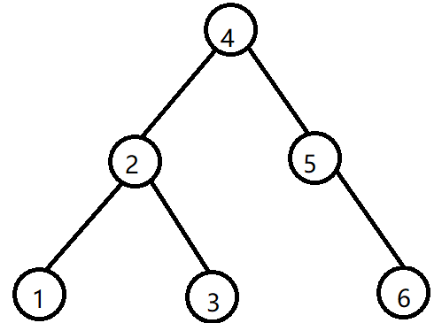

# 5.5 树和二叉树的应用

## 5.5.1 二叉排序树（BST）

### 定义

二叉排序树，也叫二叉查找时，二叉搜索树，可以是一颗空树。具有以下特征：

* 若左子树非空，则左子树上所有结点的值均小于根结点的值。
* 若右子树非空，则右子树上的所有结点的值均大于根结点的值。
* 左右子树也分别是一颗二叉排序树。

对其进行中序遍历，变得到一个有序的序列。

 

对上图进行中序遍历就是： 1 2 3 4 5 6

### 二叉排序树的查找

比如查找 3，根据上面定义的规则，从树根开始查找，先和根结点进行比较，发现数据 3 比 4 小，则移动指针下沉到根结点的左孩子，然后和数据为 2的结点进行比较，发现，3 比 2 大，所以结点数据为 2 的结点下沉到其右孩子，和 3 比较，发现相等，这样就找到了。

代码实现：

```c++
// 二叉搜索树的搜索方式
template<class t>
TreeNode<t>* search_key(TreeNode<t>* root, t key)
{
    TreeNode<t>* current = root;
    while (current && current->Data != key)
    {
        if (current->Data > key)
            current = current->rChild;
        else
            current = current->lChild;
    }

    return current;
}
```

### 二叉排序树的插入

