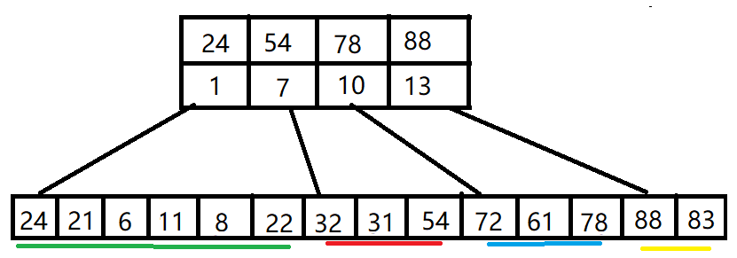

# 7.2 顺序查找和折半查找

## 7.2.1 顺序查找

顺序查找，也可以叫做线性查找，适用于链表和顺序表。对于顺序表，通过数组下标逐个递增去查找；对于链表，通过指针 next 去查找。

### 一般线性表的顺序查找

```c++
template<class t>
class Table{
    t* data;	// 指向数组的首地址
    int length;	// 长度
};

int Search_Seq(Table tb, t key)
{
    tb.elem[0] = key;	// 哨兵
    for(int i = tb.length; tb.elem[i]!=key; --i)	// 逆序来找
        ;
    
        return i;
}
```

如果表中的元素有序，比如表中元素是int类型，按从小到大排序，那么查找时不用从表的一端查到另一端，只需查找到比他大（或者小）的一个元素后，即算查找失败。

```c++
比如一个表大从小排到大：
int a[] = {1,2,3, 5,6, 8,9,10};

现在要查找 key = 7 的元素
那么查找时，在 6和8之间并没有7这个元素，从头往后查，查到8时即可停止查找。
```

## 7.2.2 折半查找

折半查找，又称为二叉查找。仅适用于有序的顺序表。

基本思想：首先将给定值 key 与表中中间位置的元素比较，若相等，则查找成功，返回该元素的位置；若不等，则所需查找的元素只能在中间元素以外的前半部分或后半部分。然后缩小范围继续相同的查找，不断迭代，直到找到位置，或确定表中没有 key。

```c++
template<class t>
int Binary_Search(SeqList l, t key)
{
    int low = 0, high = l.length - 1, mid;
    while(low <= high)
    {
        mid = (low + high) / 2;
        if(l.elem[mid] == key)
            return mid;
        else if(l.elem[mid] > key)
            high = mid - 1;		// 从前半部分查找
        else
            low = mid + 1;		// 从后半部分查找
    }
    
    return -1;	// 查找失败
}
```

## 7.2.3 分块查找

分块查找，也称索引顺序查找。

基本思想：将查找表分为若干子块。块内的元素可以无序，但块之间是有序的，即第一个块中的最大关键字小于第二个块中的所有记录的关键字，第二个块中的最大关键字小于第三个块中的所有记录的关键字，以此类推。再建立一个索引表，索引表中的每个元素含有各块的最大关键字和各块中的第一个元素的地址，索引表按关键字有序排序。

查找过程：

①在索引表中确定待查记录所在块，可以顺序查找或折半查找找索引表

②在块内顺序查找。

例如：关键字集合：{88,24,72,61,21,6,32,11,8,31,22,83,78,54}，按照关键字值24, 54, 78, 88分为4个块和索引表。

 

