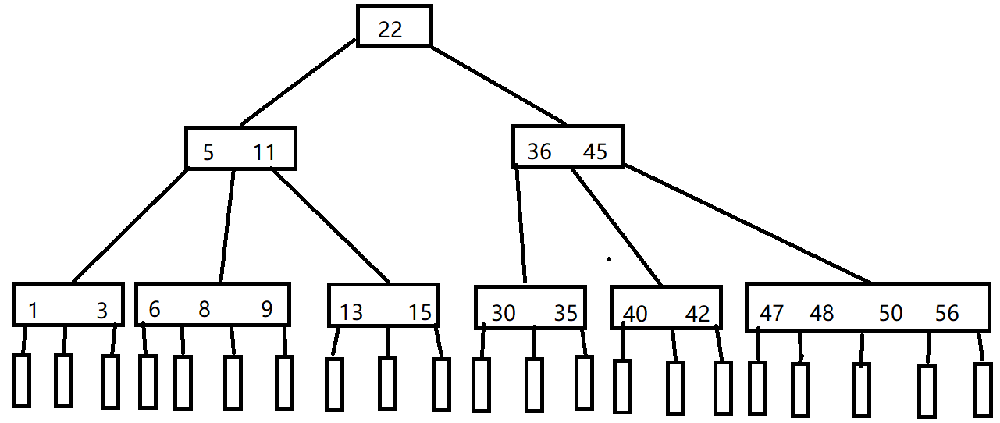
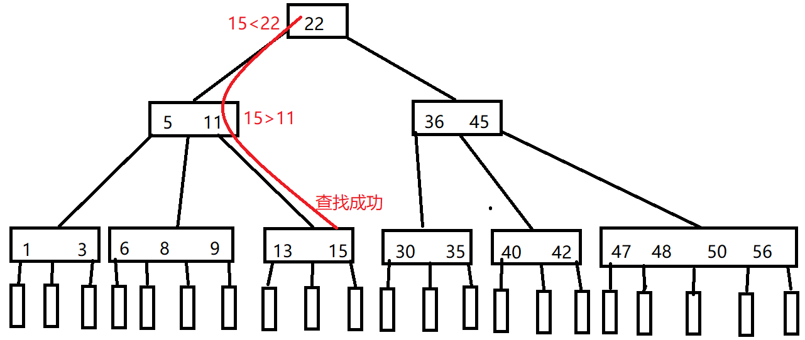
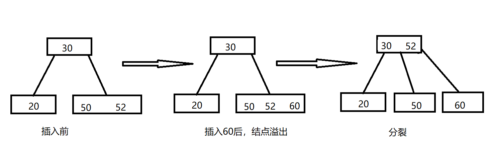
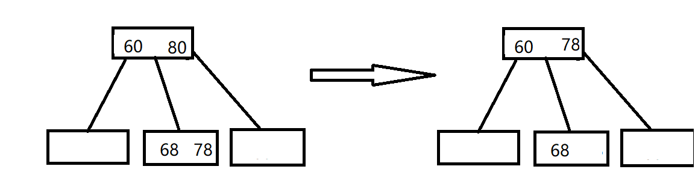
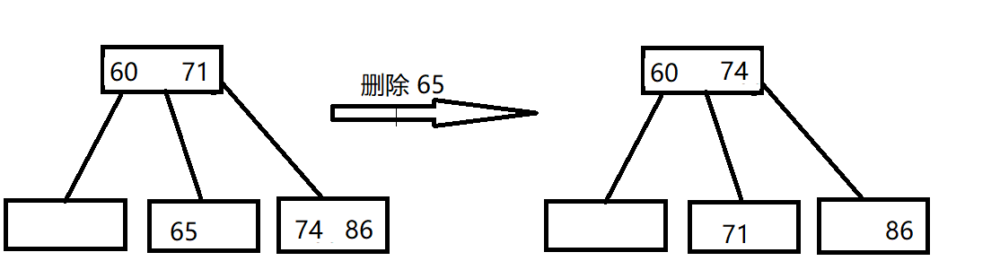
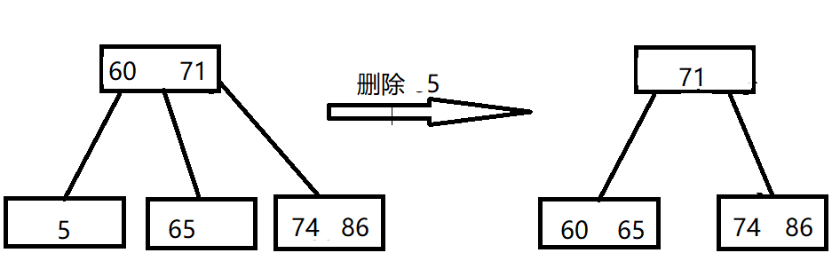

# 7.3 B 树和 B+ 树

## 7.3.1 B 树及其基本操作

B 树，又称多路平衡查找树，B 树中所有结点的孩子个数的最大值称为 B 树的阶，通常用 m 表示。一个 m 阶 B 树或为空树，或满足以下条件：

① 树中每个结点至多有 m 棵子树，即至多含有 m-1 个关键字。

② 若根结点不是终端结点，则至少有两课子树。

③ 除根结点外的所有非叶结点至少有⌈m/2⌉ 棵子树，即至少含有⌈m/2⌉-1个关键字。

④ 所有的叶结点都出现在同一层次上，并且不带信息。

B 树是所有结点的平衡因子均等于0的多路平衡查找树。

示例：

 

从图中可以看出一些性质：

* 结点的孩子个数等于结点中关键字个数+1。
* 如果根结点没有关键字就没有子树，此时B树为空；如果根结点有关键字，则其子树必然大于等于两颗子树。
* 除根结点外的所有非终端结点至少有 ⌈m/2⌉ = ⌈5/2⌉=3 棵子树，至多有 5 棵子树。
* 结点中关键字从左到右递增有序，关键字两侧均有指向子树的指针，左边指针所指子树的所有关键字均小于该关键字，右边指针所指子树的所有关键字均大于该关键字。或者看成下层结点关键字总是落在由上层结点关键字所划分的区间内，如第二层最左边结点的关键字划分成了三个区间：(-∞, 5)，(5 11)，(11, +∞)，该结点 3 个指针所指子树的关键字均落在这 3 个区间内。
* 所有叶节点均在第 4 层，代表查找失败的位置。

### 树的高度（磁盘存取次数）

这里我们说树的高度不包括最后的不带任何信息的叶结点所处的那一层。

若 n ≥ 1，则对任意一棵包含 n 个关键字、高度为 h、阶数为 m 的 B 树：

① 因为 B 树中每个结点最多有 m 棵子树，m-1 个关键字，所以在一棵高度为 h 的 m 阶 B 树中关键字个数应满足 n ≤ (m-1)(1+m+m²+…+ m^h)= m^h -1，即 h ≥ log₍m₎(n+1)

② 若让每个结点中的关键字个数达到最少，则容纳同样多关键字的 B 树的高度达到最大。第一层至少有 1 个结点，第二层至少有 2 个结点；除根结点外的每个非终端结点至少有 ⌈m/2⌉ 棵子树，则第三层至少有2⌈m/2⌉个结点，第 h+1 层至少有2(⌈m/2⌉)^(h-1)个结点，这里的第h+1层不包含任何信息的结点。对于关键字个数为 n 的 B 树，叶结点即查找不成功的结点为 n+1，由此有 n+1 ≥ 2(⌈m/2⌉)^(h-1)，即 h ≤log₍⌈m/2⌉₎((n+1)/2) + 1。

综上，h的范围为： log₍m₎(n+1) ≤ h ≤log₍⌈m/2⌉₎((n+1)/2) + 1

### B 树的查找

与二叉查找树相似，不过二叉是两路分支，B 树是多路分支。

#### 如何查找？

① 在B 树中找结点。

② 在结点内找关键字。

由于 B 树常存在磁盘上，因此前一个查找操作是在磁盘上进行的，而后一个查找操作是在内存中进行的，即在找到目标后，先将结点信息读入内存，然后在结点内采用顺序查找法或折半查找法。

在 B 树上查找到某个结点后，先在有序表中进行查找，若找到则查找成功，否则按照对应的指针信息到所指的子树中去查找。

比如查找15：

 

### B 树的插入

① 定位。利用 B 树查找法，找出插入该关键字的最底层中的某个非叶结点。

② 插入。在 B 树中，每个非失败结点的关键字个数都在区间 [⌈m/2⌉-1, m-1]内。插入后的结点关键字个数小于 m，可以直接插入；插入后检查被插入结点内关键字的个数，当插入后的结点关键字个数大于 m -1 时，必须对结点进行分裂。

* 分裂：取一个新结点，在插入 key 后的原结点，从中间位置(⌈m/2⌉) 将其中的关键字分成两部分，左部分包含的关键字放在原结点中，右部分包含的关键字放在新结点中，中间位置（⌈m/2⌉）的结点插入原结点的父结点。若此时导致其父结点的关键字个数也超过了上限，则继续按照这种分裂操作，直至这个过程传到根结点为止，进而导致B树高度增1。

 

### B 树的删除

B 树要求结点中的关键字个数≥⌈m/2⌉-1，所有在删除结点时可能需要合并。

当被删关键字 k 不在终端结点（最底层非叶结点）中时，可以用 k的前驱或者后继k'代替k，然后在相应的结点中删除 k'，关键字 k'必定落在某个终端结点中，则转换成了被删除关键字在终端结点中的情况。

 

当被删除关键字在终端结点（最底层非叶结点）中时，考虑以下三种情况。

① 直接删除关键字。若被删除关键字所在结点的关键字个数 ≥ ⌈m/2⌉，表明删除该关键字后依然满足 B 树，则直接删除该关键字。

② 兄弟够借。若被删除关键字所在结点删除前的关键字个数 = ⌈m/2⌉-1，且与此结点相邻的右（或左）兄弟结点的关键字≥ ⌈m/2⌉，则需要调整该结点、右（或左）兄弟结点及其双亲结点，以达到新的平衡。

 

③ 兄弟不够借。若被删除关键字所在结点删除前的关键字个数为 ⌈m/2⌉ -1，且此时与该结点相邻的左、右兄弟结点的关键字个数均为 ⌈m/2⌉ -1，则将关键字删除后与左（或右）兄弟结点及双亲结点中的关键字进行合并。在合并过程中，双亲结点中的关键字个数会减1.若双亲结点是根结点且关键字个数减少至0，则直接删除根结点，合并后的新结点称为根；若双亲结点不是根结点，且关键字个数减少到⌈m/2⌉ -2，则又要与它自己的兄弟结点进行调整合并操作，不断迭代上述操作，直到满足B树要求为止。

 

## 7.3.2 B+树的基本概念

B+ 树是应用数据库所需而出现的一种 B 树的变形树。

一颗 m 阶的 B+ 树满足下列条件：

* 每个分支结点最多有 m 棵子树（孩子结点）。

* 非叶根结点至少有两棵子树，其他每个分支结点至少有 ⌈m/2⌉ 棵子树。

* 结点的子树个数与关键字个数相等。

* 所有叶结点包含全部关键字及指向相应记录的指针，叶结点中关键字按大小顺序排列，并且相邻叶结点按大小顺序相互链接起来。

* 所有分支结点（可视为索引的索引）中仅包含它的各个子结点中关键字的最大值及指向其子结点的指针。

  
