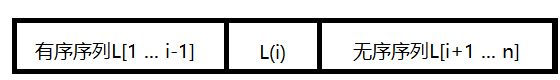

# 8.2	插入排序

每次将一个待排序的记录按其关键字大小插入前面已排好序的子序列，直到全部记录插入完成为止。

## 8.2.1	直接插入排序

待排序表如下：



要将 L(i) 插入已有序的子序列 L[1 ... i-1]，执行以下操作：

① 查找出 L(i) 在 L[1 ... i-1] 中的插入位置 k。

② 将 L[k ... i-1]中的所有元素依次后移一个位置。

③ 将L(i) 赋值到 L(k)。

可以将第一个元素看成已经排好序了，对接下来的 n -1 个元素依次执行步骤 ①②③。

```c++
// 插入排序 升序排序
	void InsertSort(T data[], int n)
	{
		T temp; // 哨兵

		// 默认第一个元素已排好序
		for (int i = 1; i < n; i++)
		{
			temp = data[i];
			int j = i - 1;
			// 找出 k 位置，当结束循环时，j+1就是k的位置
			while(j >= 0 && data[j] > temp)
			{
				data[j + 1] = data[j];
				j--;
			}
			data[j + 1] = temp;
		}
	}
```

| i        | temp | 1      | 2      | 3      | 4      | 5      | 6      | 7      | 8      |
| -------- | ---- | ------ | ------ | ------ | ------ | ------ | ------ | ------ | ------ |
| 初始化时 |      | **49** | 38     | 65     | 97     | 76     | 13     | 27     | 49     |
| 1        | 38   | **38** | **49** | 65     | 97     | 76     | 13     | 27     | 49     |
| 2        | 65   | **38** | **49** | **65** | 97     | 76     | 13     | 27     | 49     |
| 3        | 97   | **38** | **49** | **65** | **97** | 76     | 13     | 27     | 49     |
| 4        | 76   | **38** | **49** | **65** | **76** | **97** | 13     | 27     | 49     |
| 5        | 13   | **13** | **38** | **49** | **65** | **76** | **97** | 27     | 49     |
| 6        | 27   | **13** | **27** | **38** | **49** | **65** | **76** | **97** | 49     |
| 7        | 49   | **13** | **27** | **38** | **49** | **49** | **65** | **76** | **97** |

空间效率：常数个辅助单元，O(1)。

时间效率：O(n²)

## 8.2.2	折半插入排序

直接插入排序的工作原理：

从前半部分有序子序列中找出待插入元素的位置k，然后位置 k （包括k的元素）都往后移动。查找时用的是顺序查找，我们可以改进一下，查找时用折半查找，这样会快一些（要求存储是按照数组存储）。


```c++
void BinaryInsertSort(T data[], int n)
	{
		T temp; // 哨兵
		int low = 0; // 起始位置
		int high = 0; // 末尾位置
		int mid = 0;	// 中间点

	// 默认第一个元素已经排好序
	for (int i = 1; i < n; i++)
	{
		low = 0;
		high = i - 1; // 末尾位置
		temp = data[i];
        
        // 循环结束，待插入位置就是 low
		while (low <= high)
		{
			mid = (low + high+1) / 2; // 取中间点
			if (data[mid] < temp)
			{
				low = mid + 1;
			}
			else
			{
				high = mid - 1;
			}
		}

		for (int x = i- 1; x >= low; x--)
		{
			data[x + 1] = data[x];
		}
		data[low] = temp;
	}
}
```

## 8.2.3	希尔排序

基本思想：先将待排序表分割成若干形如 L[i, i+d, i + 2d, ... , i + kd]的子表，即把相隔某个增量的纪录组成一个子表，对各个子表分别进行直接插入排序，当表中的元素呈基本有序时，再对全体进行一次直接排序。

```c++
// 这里 A[0]不存储序列元素，仅仅作为临时变量，意味着传进来的数组，A[0]不能存储序列元素
void ShellSort(int A[], int n)
{
    for(int d= n/2; d >= 1; d = d/2)
    {
        // 对划分的子表排序
        for(int i = d+1; i <= n; i++)
        {
            if(A[i] < A[i-d]){
                A[0] = A[i]; // 待插入元素先放到 A[0]
                // 直接插入法
                for(int j = i -d; j > 0 && A[0] < A[j]; j-=d)
                {
                    A[j+d] = A[j];
                }
                A[j+d] = A[0];
            }
        }
    }
}
```

看下面例子：

关键字初始化：

| 1    | 2    | 3    | 4    | 5    | 6    | 7    | 8    | 9    | 10   |
| ---- | ---- | ---- | ---- | ---- | ---- | ---- | ---- | ---- | ---- |
| 49   | 38   | 65   | 97   | 76   | 13   | 27   | 49   | 55   | 4    |

第一轮 d = 10/2 = 5，也就是说下标为 1 1+5为一组，2 2+5 为一组。以此类图。

| 1    | 2    | 3    | 4    | 5    | 6    | 7    | 8    | 9    | 10   |
| ---- | ---- | ---- | ---- | ---- | ---- | ---- | ---- | ---- | ---- |
| 49   | 38   | 65   | 97   | 76   | 13   | 27   | 49   | 55   | 4    |
| 49   |      |      |      |      | 13   |      |      |      |      |
|      | 38   |      |      |      |      | 27   |      |      |      |
|      |      | 65   |      |      |      |      | 49   |      |      |
|      |      |      | 97   |      |      |      |      | 55   |      |
|      |      |      |      | 76   |      |      |      |      | 4    |

第三行的两个元素划分为一个子表，第四行、第五行、第六行以及第七行都是独自划分为一个子表。

这样一来，第一个子表相互交换位置，第二子表也要相互换位置，第三也要换，第四也要换，第五也要换。

| 1    | 2    | 3    | 4    | 5    | 6    | 7    | 8    | 9    | 10   |
| ---- | ---- | ---- | ---- | ---- | ---- | ---- | ---- | ---- | ---- |
| 49   | 38   | 65   | 97   | 76   | 13   | 27   | 49   | 55   | 4    |
| 13   |      |      |      |      | 49   |      |      |      |      |
|      | 27   |      |      |      |      | 38   |      |      |      |
|      |      | 49   |      |      |      |      | 65   |      |      |
|      |      |      | 55   |      |      |      |      | 97   |      |
|      |      |      |      | 4    |      |      |      |      | 76   |

这样第一趟排序就得到：

| 1    | 2    | 3    | 4    | 5    | 6    | 7    | 8    | 9    | 10   |
| ---- | ---- | ---- | ---- | ---- | ---- | ---- | ---- | ---- | ---- |
| 13   | 27   | 49   | 55   | 4    | 49   | 38   | 65   | 97   | 76   |

然后d=d/2=5/2=2。重新划分子表。

| 1    | 2    | 3    | 4    | 5    | 6    | 7    | 8    | 9    | 10   |
| ---- | ---- | ---- | ---- | ---- | ---- | ---- | ---- | ---- | ---- |
| 13   | 27   | 49   | 55   | 4    | 49   | 38   | 65   | 97   | 76   |
| 13   |      | 49   |      | 4    |      | 38   |      | 97   |      |
|      | 27   |      | 55   |      | 49   |      | 65   |      | 76   |

然后对子表进行插入排序：

| 1    | 2    | 3    | 4    | 5    | 6    | 7    | 8    | 9    | 10   |
| ---- | ---- | ---- | ---- | ---- | ---- | ---- | ---- | ---- | ---- |
| 13   | 27   | 49   | 55   | 4    | 49   | 38   | 65   | 97   | 76   |
| 4    |      | 13   |      | 38   |      | 49   |      | 97   |      |
|      | 27   |      | 49   |      | 55   |      | 65   |      | 76   |

第二趟排序后得到：

| 1    | 2    | 3    | 4    | 5    | 6    | 7    | 8    | 9    | 10   |
| ---- | ---- | ---- | ---- | ---- | ---- | ---- | ---- | ---- | ---- |
| 4    | 27   | 13   | 49   | 38   | 55   | 49   | 65   | 97   | 76   |

d=2/2=1；就是对最后一个表进行直接插入排序了。

| 1    | 2    | 3    | 4    | 5    | 6    | 7    | 8    | 9    | 10   |
| ---- | ---- | ---- | ---- | ---- | ---- | ---- | ---- | ---- | ---- |
| 4    | 13   | 27   | 38   | 49   | 49   | 55   | 65   | 76   | 97   |

希尔排序算法不稳定，看上述的例子，本来后面的49，排到了前面49。