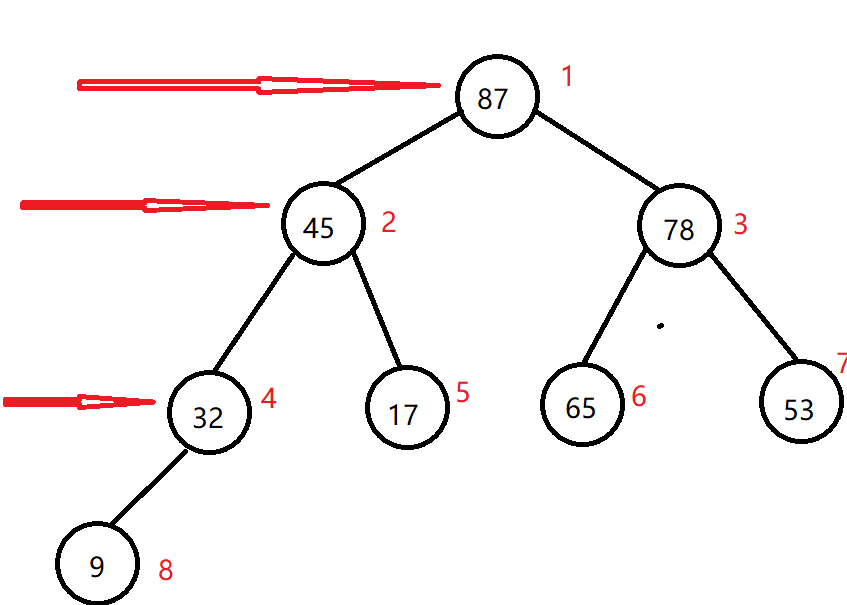
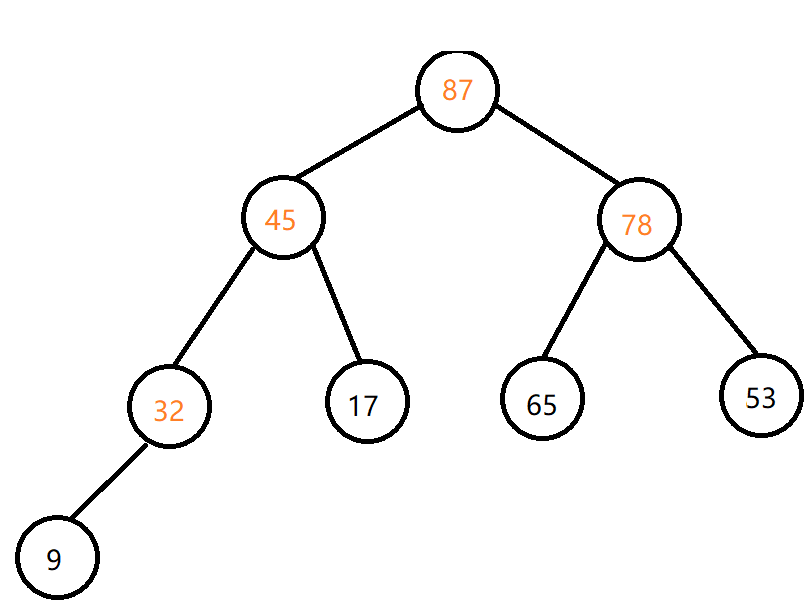

# 8.4	选择排序

## 8.4.1	简单选择排序

基本思想：每一趟在后面 n- i -1(i = 1,2,...,n-1)个待排序元素中选择关键字最小的元素，作为有序子序列的第 i 个元素。直到第 n -1 趟执行完毕。

```c++
// 选择排序
void SelectSort(int A[], int n)
{ 
	
	for (int i = 0; i < n - 1; i++)
	{
		int j = i;
		int min = A[i];
		int flag = i;	// 最小元素的下标

		// 找到最小值
		for (; j < n; j++)
		{
			if (min > A[j])
			{
				min = A[j];
				flag = j;
			}
		}

		int tmp = A[flag];
		A[flag] = A[i];
		A[i] = tmp;
	}
}


```

这个算法不稳定。

## 8.4.2	堆排序

什么是“堆”？

若 n 个关键字序列 L[1 ... n] 满足下面某一条性质，则称为堆（Heap）:

① 满足：L(i) ≥ L(2i) 且 L(i) ≥ L(2i+1) (1≤ i ≤ n/2)————称为**大根堆**

② 满足:   L(i) ≤ L(2i) 且 L(i) ≤ L(2i+1) (1≤ i ≤ n/2)————称为**小根堆**

从二叉树的视觉：

 

如果按照层次遍历来标号，那就是对应的数组了。

 

| 0    | 1    | 2    | 3    | 4    | 5    | 6    | 7    | 8    |
| ---- | ---- | ---- | ---- | ---- | ---- | ---- | ---- | ---- |
|      | 87   | 45   | 78   | 32   | 17   | 65   | 53   | 09   |

即 根≥左、右结点（大根堆）。

这样每次选一个最大的值出来，就很快，直接就是根结点的值最大。

**问题是怎么建立大根堆？**

### 建立大根堆

假如初始序列为：

| 0    | 1    | 2    | 3    | 4    | 5    | 6    | 7    | 8    |
| ---- | ---- | ---- | ---- | ---- | ---- | ---- | ---- | ---- |
| 53   | 53   | 17   | 78   | 9    | 45   | 65   | 87   | 32   |

第一步：把所有非终端结点都检查一遍，是否满足大根堆的要求，如果不满足，则进行调整。非终端结点有个特点：下标 ≤ ⌊n/2⌋

 

在这个例子中，只需检查 i ≤ 4下标的结点。

应该从后往前处理。也就是元素为 9 的结点进行调整。

提示：

i 的左孩子——2i

i 的右孩子——2i+1

i 的父结点——⌊i/2⌋

显然这里以元素9为子树的树不满足大根堆，需要与当前结点的更大的一个孩子互换。

 

互换后：

 

此时数组为：

| 0    | 1    | 2    | 3    | 4    | 5    | 6    | 7    | 8    |
| ---- | ---- | ---- | ---- | ---- | ---- | ---- | ---- | ---- |
|      | 53   | 17   | 78   | 32   | 45   | 65   | 87   | 9    |

这时候到下标为3的元素，发现不满足大根堆：

 

需要和孩子中最大的结点进行互换：

 

此时数组为：

| 0    | 1    | 2    | 3    | 4    | 5    | 6    | 7    | 8    |
| ---- | ---- | ---- | ---- | ---- | ---- | ---- | ---- | ---- |
|      | 53   | 17   | 87   | 32   | 45   | 65   | 78   | 9    |

接着处理下标为 2 的结点。

 

接下来换下标为 1 的结点：

 

这个时候，发现根结点的右子树（53）没有符合大根堆要求，继续调整：

 

此时数组：

| 0    | 1    | 2    | 3    | 4    | 5    | 6    | 7    | 8    |
| ---- | ---- | ---- | ---- | ---- | ---- | ---- | ---- | ---- |
|      | 87   | 45   | 78   | 32   | 17   | 65   | 53   | 9    |

相关代码：

```c++
void BuildMaxHeap(int A[], int len)
{
    for(int i=len/2; i > 0; i--)	// 从后往前调整所有非终端结点
        HeadAdjust(A, i, len);
}

void HeadAdjust(int A[], int k, int len)
{
    A[0]=A[k];	// A[0] 暂时存放子树的根结点
    for(int i = 2*k; i <= len; i*=2){ // 沿 key 较大的子结点向下筛选
        if(i < len && A[i] < A[i+1]) // 取key较大的子结点的下标
            i++;
        if(A[0] >=A[i])
            break;	// 筛选结束
        else{
            A[k]=A[i];	// 将 A[i] 调整到双亲结点上
            k=i;		// 修改 k 值，以便继续向下筛选
        }
    }
    A[k] = A[0];		// 被筛选结点的值放入最终位置
}

// 堆排序的完整逻辑
void HeapSort(int A[], int len)
{
    BuildMapHead(A,len);	// 初始建堆
    for(int i = len;i>1; i--)	// n-1趟的交换过程和建堆过程
    {
        swap(A[i], A[0]);	// 堆顶元素和堆底元素互换
    }		
    HeadAdjust(A,1, i-1);	// 把剩余待排序元素整理成堆
}
```

大根堆建立之后，将最大元素（根元素）和待排序序列中的最后一个元素交换：

 

此时数组：

| 0    | 1    | 2    | 3    | 4    | 5    | 6    | 7    | 8      |
| ---- | ---- | ---- | ---- | ---- | ---- | ---- | ---- | ------ |
|      | 9    | 45   | 78   | 32   | 17   | 65   | 53   | **87** |

87已经算是一个排好序的子序列了。现在下标为 1 的元素（值为9）又不满足大根堆了，需要重新调整，直接调用 HeadAdjust(A, 1, 7)。

 

| 0    | 1    | 2    | 3    | 4    | 5    | 6    | 7    | 8      |
| ---- | ---- | ---- | ---- | ---- | ---- | ---- | ---- | ------ |
|      | 78   | 45   | 65   | 32   | 17   | 9    | 53   | **87** |

继续将堆顶元素和待排序最后一个元素交换。

 

| 0    | 1    | 2    | 3    | 4    | 5    | 6    | 7      | 8      |
| ---- | ---- | ---- | ---- | ---- | ---- | ---- | ------ | ------ |
|      | 53   | 45   | 65   | 32   | 17   | 9    | **78** | **87** |

53 又不符合大根堆了。继续调整：HeadAdjust(A, 1, 6)

 

此时数组：

| 0    | 1    | 2    | 3    | 4    | 5    | 6    | 7      | 8      |
| ---- | ---- | ---- | ---- | ---- | ---- | ---- | ------ | ------ |
|      | 65   | 45   | 53   | 32   | 17   | 9    | **78** | **87** |

继续将对顶元素和待排序最后一个元素互换 

 

此时数组：

| 0    | 1    | 2    | 3    | 4    | 5    | 6      | 7      | 8      |
| ---- | ---- | ---- | ---- | ---- | ---- | ------ | ------ | ------ |
|      | 9    | 45   | 53   | 32   | 17   | **65** | **78** | **87** |

接着还是执行调整HeadAdjust(A, 1, 5)：

 

此时数组：

| 0    | 1    | 2    | 3    | 4    | 5    | 6      | 7      | 8      |
| ---- | ---- | ---- | ---- | ---- | ---- | ------ | ------ | ------ |
|      | 53   | 45   | 9    | 32   | 17   | **65** | **78** | **87** |

接着互换 ：

 

此时数组：

| 0    | 1    | 2    | 3    | 4    | 5      | 6      | 7      | 8      |
| ---- | ---- | ---- | ---- | ---- | ------ | ------ | ------ | ------ |
|      | 17   | 45   | 9    | 32   | **53** | **65** | **78** | **87** |

接着调整HeadAdjust(A, 1, 4)：

 

接着互换：

 

此时数组

| 0    | 1    | 2    | 3    | 4      | 5      | 6      | 7      | 8      |
| ---- | ---- | ---- | ---- | ------ | ------ | ------ | ------ | ------ |
|      | 17   | 32   | 9    | **45** | **53** | **65** | **78** | **87** |

接着调整HeadAdjust(A, 1, 3)：


接着互换：

 

此时数组

| 0    | 1    | 2    | 3      | 4      | 5      | 6      | 7      | 8      |
| ---- | ---- | ---- | ------ | ------ | ------ | ------ | ------ | ------ |
|      | 9    | 17   | **32** | **45** | **53** | **65** | **78** | **87** |

接着调整HeadAdjust(A, 1, 2)：


接着互换：

 

此时数组：

| 0    | 1    | 2      | 3      | 4      | 5      | 6      | 7      | 8      |
| ---- | ---- | ------ | ------ | ------ | ------ | ------ | ------ | ------ |
|      | 9    | **17** | **32** | **45** | **53** | **65** | **78** | **87** |

这样就得到一个有序的数组了！！！