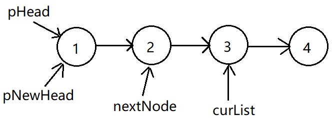

# 反转链表

来源：牛客网 **NC78** **反转链表**

 

翻转，可以利用栈的知识去解决，先把链表从表头到表尾的顺序按序入栈。然后再出栈，按照先出栈的结点顺序串起来的链表便是目标要求的新链表。但是如果用栈，空间复杂度就是O(n)，所以用指针来解决。

以四个结点为例：

第一轮循环：

 

第一轮循环结束后：

 

第二轮结束后：

 

第三轮结束后：

 

跳出 while 循环后，将新链表的末尾结点的next域指向nullptr。

 


```c++
struct ListNode {
    int val;
    struct ListNode *next;
    ListNode(int x) :
            val(x), next(NULL) {
    }
};

class Solution {
public:
    ListNode* ReverseList(ListNode* pHead) {
        if (pHead == nullptr)
            return pHead;

        ListNode* pNewHead = pHead; // 新链的链头
        ListNode* nextNode = pHead->next; // 下一下待翻转结点
        ListNode* curList;  // 当前待翻转链表链头
        while (nextNode != nullptr)
        {
            curList = nextNode->next;
            nextNode->next = pNewHead;
            pNewHead = nextNode;
            nextNode = curList;
        }

        pHead->next = nullptr;    // 令新链表的尾部元素的next域指向空指针
        return pNewHead;
    }

    void Print(ListNode* pHead)
    {
        while (pHead != nullptr)
        {
            cout << pHead->val << " ";
            pHead = pHead->next;
        }
    }
};

int main(int argc, char *argv[])
{

    Solution s;
    ListNode* pHead = new ListNode(1);
    ListNode* p = pHead; 
    for (int i = 2; i < 10; i++)
    {
        p->next = new ListNode(i);
        p = p->next;
    }
    cout << "before ReverseList: " << endl;
    s.Print(pHead);
    pHead = s.ReverseList(pHead);
    cout << "\nafter ReverseList: " << endl;
    s.Print(pHead);
    return 0;
}
```

输出：

```c++
before ReverseList:
1 2 3 4 5 6 7 8 9
after ReverseList:
9 8 7 6 5 4 3 2 1
```

