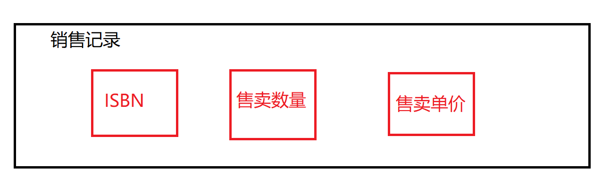

# 类简介

类是对具有相同属性的事物的抽象，是一种数据结构。一个类定义了一个类型，以及与其相关的一组操作(方法)。类机制是C++最重要的特性之一。C++设计最初的一个初衷就是能定义使用上像内置类型一样自然的类类型。

类一般定义在头文件中。

## 定义一个Sales_Item类

> 从https://www.informit.com/store/c-plus-plus-primer-9780321714114网站摘抄，本人在此去掉代码前面的作者署名的大量注释。

```c++
/*
 * This file contains code from "C++ Primer, Fifth Edition", by Stanley B.
 * Lippman, Josee Lajoie, and Barbara E. Moo, and is covered under the
 * copyright and warranty notices given in that book:
 * 
 * "Copyright (c) 2013 by Objectwrite, Inc., Josee Lajoie, and Barbara E. Moo."
 */

#ifndef SALESITEM_H
// we're here only if SALESITEM_H has not yet been defined 
#define SALESITEM_H

// Definition of Sales_item class and related functions goes here
#include <iostream>
#include <string>

class Sales_item {
// these declarations are explained section 7.2.1, p. 270 
// and in chapter 14, pages 557, 558, 561
friend std::istream& operator>>(std::istream&, Sales_item&);
friend std::ostream& operator<<(std::ostream&, const Sales_item&);
friend bool operator<(const Sales_item&, const Sales_item&);
friend bool 
operator==(const Sales_item&, const Sales_item&);
public:
    // constructors are explained in section 7.1.4, pages 262 - 265
    // default constructor needed to initialize members of built-in type
#if defined(IN_CLASS_INITS) && defined(DEFAULT_FCNS)
    Sales_item() = default;
#else
    Sales_item(): units_sold(0), revenue(0.0) { }
#endif
    Sales_item(const std::string &book):
              bookNo(book), units_sold(0), revenue(0.0) { }
    Sales_item(std::istream &is) { is >> *this; }
public:
    // operations on Sales_item objects
    // member binary operator: left-hand operand bound to implicit this pointer
    Sales_item& operator+=(const Sales_item&);
    
    // operations on Sales_item objects
    std::string isbn() const { return bookNo; }
    double avg_price() const;
// private members as before
private:
    std::string bookNo;      // implicitly initialized to the empty string
#ifdef IN_CLASS_INITS
    unsigned units_sold = 0; // explicitly initialized
    double revenue = 0.0;
#else
    unsigned units_sold;  // 一条销售记录的售卖书本数量
    double revenue;       // 一条销售记录的收入
#endif
};

// used in chapter 10
inline
bool compareIsbn(const Sales_item &lhs, const Sales_item &rhs) 
{ return lhs.isbn() == rhs.isbn(); }

// nonmember binary operator: must declare a parameter for each operand
Sales_item operator+(const Sales_item&, const Sales_item&);

inline bool 
operator==(const Sales_item &lhs, const Sales_item &rhs)
{
    // must be made a friend of Sales_item
    return lhs.units_sold == rhs.units_sold &&
           lhs.revenue == rhs.revenue &&
           lhs.isbn() == rhs.isbn();
}

inline bool 
operator!=(const Sales_item &lhs, const Sales_item &rhs)
{
    return !(lhs == rhs); // != defined in terms of operator==
}

// assumes that both objects refer to the same ISBN
Sales_item& Sales_item::operator+=(const Sales_item& rhs) 
{
    units_sold += rhs.units_sold; 
    revenue += rhs.revenue; 
    return *this;
}

// assumes that both objects refer to the same ISBN
Sales_item 
operator+(const Sales_item& lhs, const Sales_item& rhs) 
{
    Sales_item ret(lhs);  // copy (|lhs|) into a local object that we'll return
    ret += rhs;           // add in the contents of (|rhs|) 
    return ret;           // return (|ret|) by value
}

// 对>>运算符进行重写，输入书本条目时，需要输入isbn号、多少本书、单本书籍价格
std::istream& 
operator>>(std::istream& in, Sales_item& s)
{
    double price;
    in >> s.bookNo >> s.units_sold >> price;
    // check that the inputs succeeded
    if (in)
        s.revenue = s.units_sold * price;
    else 
        s = Sales_item();  // input failed: reset object to default state
    return in;
}

// 对 <<运算符进行重写，输出销售记录的isbn号，销售数量，销售数量，销售收入，每本书的平均价格
std::ostream& 
operator<<(std::ostream& out, const Sales_item& s)
{
    out << s.isbn() << " " << s.units_sold << " "
        << s.revenue << " " << s.avg_price();
    return out;
}

// 计算书的平均价格
double Sales_item::avg_price() const
{
    if (units_sold) 
        return revenue/units_sold; 
    else 
        return 0;
}
#endif

```

研读完上述代码后，输入一条销售记录的正确操作不仅仅是输入书籍isbn号码，而是要输入当前销售记录的isbn号，卖了几本，该书籍的售卖的单价。



<font color='red'>如果一条销售记录输入的数据无效，只要三者有其一无效，当前写入的记录条目的数据全部默认为0。</font>

## Sale_Item类的应用

```c++
#include <iostream>
#include "Sales_item.h"
using namespace std;

int main()
{
    Sales_item total; // 保存下一条交易记录
     
    // 读入第一条交易记录，并确保有数据处理
    if (cin >> total) {
        Sales_item trans;  // 保存和的变量
        // 读入并处理剩余交易记录
        while (cin >> trans) {
            // 如果任然在处理相同的书
            if (total.isbn() == trans.isbn())
            {
                total += trans; // 更新总销售额
            }
            else {
                //  打印前一本书的结果
                cout << total << endl;
                total = trans;  // total 现在表示下一本书的销售额
            }
        }
        cout << total << endl; // 打印最后一本书的结果
    }
    else
    {
        // 没有输入！警告读者
        cerr << "No data?!" << endl;
        return -1;
    }
    return 0; // 表示失败
}
```

