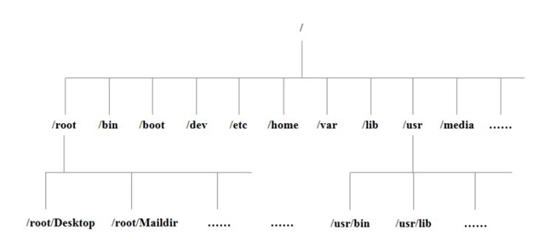

# linux 目录介绍

[内容来源]: https://www.bilibili.com/video/BV1WY4y1H7d3?p=24&amp;spm_id_from=pageDriver	"本文来源于尚硅谷linux教程系列课程"

 

| 目录        | 介绍                                                         |
| ----------- | ------------------------------------------------------------ |
| bin         | Binary的缩写，装二进制文件，主要放了一些常用的命令。         |
| /sbin       | s 是 Super User，这里存放的是系统管理员使用的系统管理程序。  |
| /home       | 存放普通用户的主目录，在 Linux 中每个用户都有一个自己的目录，一般该目录名是以用户的账号命名的。 |
| /root       | 该目录为系统管理员，也称作超级权限者的用户主目录。           |
| /lib        | 系统开机所需的最基本的动态链接共享库，其作用类似于windows里的Dll库。几乎所有的应用程序都需要用这些共享库。 |
| /lost+found | 这个目录一般情况下为空，当系统非法关机后，这里存放一些文件。 |
| /etc        | 所有的系统管理所需的配置文件和子目录。                       |
| /usr        | 一个非常重要的目录，用户的很多应用程序和文件都存放在这个目录下，类似于 windows 的 program files目录。 |
| /boot       | 存放启动linux时使用的一些核心文件，包括一些连接文件以及镜像文件。一般不允许动这个文件。 |
| /proc       | 是一个虚拟的目录，它是系统内存的映射，可以通过直接访问这个目录来获取系统信息。 |
| /srv        | service 缩写，该目录存放一些服务启动之后所需提取的数据。     |
| /sys        | 系统硬件相关。                                               |
| /tmp        | 存放临时文件。                                               |
| /dev        | 类似windows的设备管理器。把所有的硬件用文件的形式存储。      |
| /media      | linux 系统会自动识别一些设备，如U盘、光驱等等。当识别后，linux 会把识别的设备挂载到这个目录下。 |
| /mnt        | 系统提供该目录是为了让用户临时挂载别的文件系统，我们可以将外部的存储挂载在 /mnt 上，然后进入该目录就可以直接查看看里面的内容了。 |
| /opt        | 给主机额外安装软件所摆放的目录。如安装一个 mysql 数据库就可以放到这个目录下。包括各种日志文件。 |
| /selinux    | SELinux 是一种安全子系统，它能控制程序只能访问特定文件。     |

