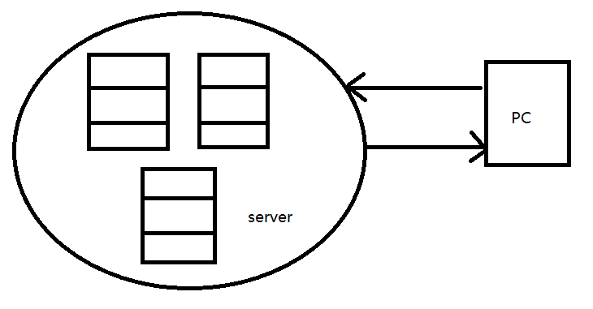
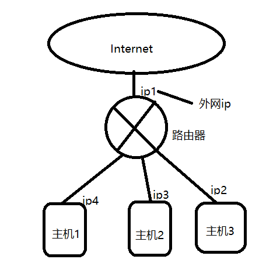
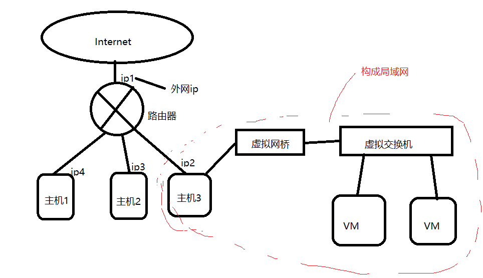
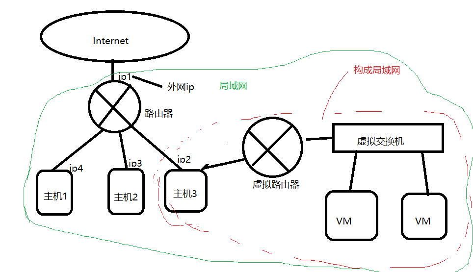
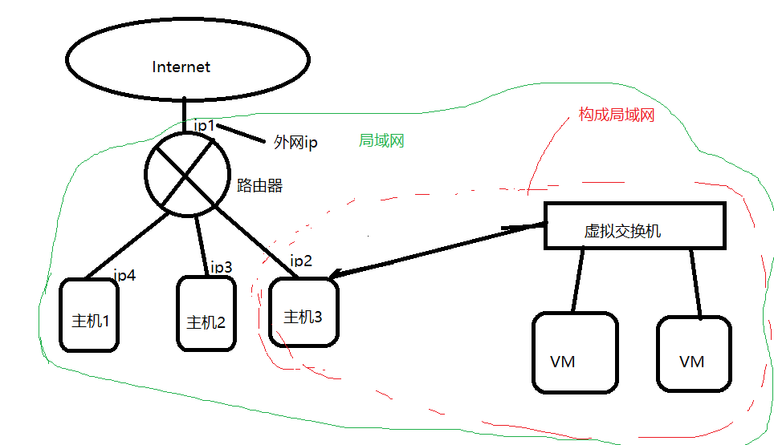

# 网络配置和远程登录

[内容来源]: https://www.bilibili.com/video/BV1WY4y1H7d3?p=24&amp;spm_id_from=pageDriver	"内容来源尚硅谷教程系列"

**本文目标**：探索主机和虚拟机通信，在 windows 主机远程登录虚拟机。

知识了解：

网关(Gateway)就是一个网络连接到另一个网络的“关口”

查看 ip 地址：

| 系统    |          |
| ------- | -------- |
| Windows | ipconfig |
| linux   | ifconfig |

一般来说，在公司中，我们的电脑是与公司内部服务器相连的：

 

我们生活中的电脑如何与 intent 相连？

通过路由器，路由器可以给一个局域网中的 pc 提供一些服务，作为信息传递的介质。路由器上还安装协议 DHCP(动态主机配置协议)管理每个主机的 ip，电脑之间访问是通过 ip 来进行确认的。

路由器对外部有一个外网IP，主机是通过共享外网IP 和 外网进行沟通的。主机1、主机2、主机3和路由器构成一个局域网。

 

如果我们在自己电脑上安装了虚拟机，那么虚拟机相当于另一台电脑，可以方便我们进行局域网内的一些测试，比如，远程登陆，scoket通信等等。

可以测试在主机和虚拟机之间进行 ping 操作。

如果我们查看 windows下的网络链接（虚拟网卡），多了两个 VMnet1 和 VMnet8？

VMnet8 的ip地址和虚拟机的ip地址在同一个网段下，所以这两个可以 ping 的通。

**VMware 提供了三种网络连接模式：**

* 桥接模式

  虚拟机直连外部物理网络，虚拟机可直接访问外网，对外可见，低位和物理主机相同。

   

* NAT 模式

  顾名思义，网络地址转换协议，虚拟机和主机构建一个专用网络（局域网），通过虚拟 NAT 设备对 ip 进行转换。虚拟机通过共享主机 ip 可访问外部网络，外部网络无法访问虚拟机。

   

  实际上并不是创建虚拟路由器，而是 NAT 和 HDCP 两个功能协议。

* 仅主机模式：虚拟机与主机共享一个专用网络，与外部网络无法通信。

   

如果仔细观察会发现 主机 ip 地址和虚拟机 ip 地址不是同一个网段下的，但是为什么它们之间还能 ping 通？

我们之前安装的是NAT模式，即使主机 ip 地址和虚拟机 ip 地址不同，也能够 ping 通，是因为我们的主机3中创建了一个虚拟网卡，这个网卡接到虚拟路由上，这个虚拟网卡就是叫做 VMnet8。所以 VMnet8的ip和虚拟机的ip是属于同一个网段的。

如果是仅主机模式下，那么主机3会构建一个虚拟网卡，用来和虚拟交互机互连，

并与VM构造一个虚拟子网。

因此如果选择桥接 模式，必须将虚拟机的 ip 设置成和主机的网段一样，网关设置一样。

## 配置静态 ip 地址

为什么要配置静态 ip 地址？

因为每次启动机器时，DHCP 是动态分配 ip 给虚拟机和物理主机的，写程序啊什么的不可能每次都要改一下ip输入吧！！！

我们这里将会对 虚拟机进行静态 ip 的配置，物理机则不用，因为我们的实验目标是用 windows远程登录 linux系统啊。

① 用终端打开文件

vim /etc/sysconfig/network-scripts/ifcfg-ens33(可通过ifconfig查看ip在哪个文件，这里是 ifcfg-ens33)

② 修改 BOOTPROTO="dhcp" 改成 BOOTPROTO="static"

③ 添加ip 地址：

IPADDR=192.168.19.100

GATEWAY=192.168.19.2

DNS1=192.168.19.2

保存文件。

④ 重启网络配置：

[root@hadoop100 ~] service network restart

配置好后，可以去windows进行ping，查看是不是可以 ping 通。ping不通可能是防火墙的问题。

## 配置主机名

为什么配置主机名？方便远程登录时，输入主机名即可。

显示主机名：

[root@hadoop100 ~] hostname

vim /etc/hostname

修改其名（需要重启）

或者 hostnamectl set-hostname hadoop99

再打开终端就改掉主机名了。

### hosts 文件的作用

配置 hostname 和 ip 地址的映射。

修改了主机名后，去host文件配置ip和主机名：

192.168.19.100	hadoop100

windows 下的hosts文件路径：C:\Windows\System32\drivers\etc

这时候，在windows 下直接 ping hadoop100 就能 ping 通对应的 ip。

## 远程登录

上面都配置好后，在windows cmd 下输入 

ssh root@hadoop100

输入密码，就进入了虚拟机root权限了。可以查看目录。

可以使用 Xshell ，SSH secure Shell等软件，可以记住密码，每次登录不用重新输入密码。

Xftp 7可以连接远程，并进行客户端和服务端的文件传输。远程拷贝和复制等。

如果显示中文出现乱码：

点击菜单栏的属性-选项-编码，选utf-8。
