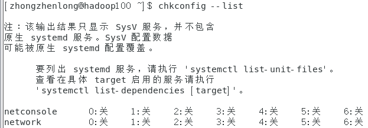

# 系统管理

[内容来源]: https://www.bilibili.com/video/BV1WY4y1H7d3?p=24&spm_id_from=pageDriver	"内容来源尚硅谷教程系列"

## 1. linux 服务管理

### 进程和服务的介绍

进程是程序装载入内存，正在被执行的程序。

服务是启动电脑后，常驻内存的一种进程。到关机时才退出。也称**守护进程**。

### service 服务管理

之前修改 ip 后，启动用 service network restart 命令，意思是重启网络服务。

centos 6版本的基本语法：

**service 服务名 start|stop|restart|status**

查看服务的方法：/etc/init.d/服务名

显示出来的四个，绿色的是可执行程序。

centos 7版本的基本语法：

**systemctl start|stop|restart|status	服务名**

查看服务的方法：/usr/lib/systemd/system

我们可以关掉 network 和 NetworkManager 服务，这样就不能访问网络了，外部物理机器有ping不通。

建议停掉 network ，启用 NetworkManager。

## 2. 系统运行级别

输入命令行 

终端输入 setup 回车，就会进入一个页面，选择系统服务，然后就进入到系统服务配置页面。

 

前面带星的是说这个服务开机自启动。无星说明开启不启动，需要手动启动。

选中后按空格，服务就不会自启动或者自启动。

\<SysV initscripts\> 说明是老版本的启动服务。systemd services  是新版本的服务。

### Linux 进程运行级别

老版本：

开机——>BIOS——>/boot——>init 进程——>运行级别——>运行级对应的服务

查看默认级别：vi /etc/inittab

Linux 系统有 7 种运行级别：常用3和5

| 运行级别 | 功能说明                                                     |
| -------- | ------------------------------------------------------------ |
| 0        | 系统停机状态，系统默认运行级别不能设为 0，否则不能正常启动。 |
| 1        | 单用户工作状态，root 权限，用于系统维护，禁止远程登录。      |
| 2        | 多用户状态（没有NFS），登录后进入控制台命令模式。            |
| 3        | 完全的多用户状态（没有NFS），登录后进入控制台命令行模式。    |
| 4        | 系统未使用，保留                                             |
| 5        | X11控制台。登录后进入图形GUI模式                             |
| 6        | 系统正常关闭并重启，默认运行级别不能设为6，否则不能正常启动  |

NFS ：network file system

CentOS 7 的运行级别简化为：

multi-user.target 等价于原运行级别3（多用户有网，无图形界面）

graphical.target 等价于原运行级别5（多用户有网，有图形界面）

查看当前运行级别：

systemctl get-default

命令行下转换运行级别：

| 运行级别转换命令 |                                    |
| ---------------- | ---------------------------------- |
| init 3           | 进入大黑框，需要登录 root 输入密码 |
| init 5           | 进入图形界面，也需要登录用户密码   |

## 3. 配置开机服务和防火墙

老版本：

chkconfig --list

列出老版本的SysV服务：

 

假如我们用setup去关闭 network，再回来看，**2-6的运行级别被关掉了：**

 

使用命令行操作的话就是：

chkconfig newtork on/off

下面这个操作是把network对应的3级别关掉：

chkconfig --level 3 network off

我们查看 NetworkManager的状态，会发现它的状态是 enabled 的

 

如果想改成开机不要自启动，直接输入下面的命令：

systemctl disable NetworkManager

再次查看状态：

 

如果想改成开机自启动，就输入下面的命令：

systemctl enable NetworkManager

查看开机自启动的服务：

systemctl list-unit-files

 

可以看出服务有三种状态：

| 状态     | 功能说明                                                     |
| -------- | ------------------------------------------------------------ |
| enabled  | 开机启动                                                     |
| disabled | 开机不启动                                                   |
| static   | 不确定，这个服务依赖于其他服务。服务启动用到其他服务A，A没启动它就没法启动。 |

### 实战：配置防火墙的自启动

防火墙：

老版本：iptables

CentOS 7：fire walld

还记得查看服务状态吗？

systemctl status firewalld，

[防火墙]: https://baike.baidu.com/item/%E9%98%B2%E7%81%AB%E5%A2%99/52767	"防火墙能做什么"

 

看出是 enabled，是开机自启动的，意味着如果现在输入命令行 systemctl stop firewalld，防火墙会立即停止，但是下次开机，防火墙又自动开启。

要关闭其开机自启动，就要输入 systemctl disable firewalld.service。但是 5 级别下它还是开机自启动的。

## 4. 关机&重启

| 命令           | 功能说明                     |
| -------------- | ---------------------------- |
| shutdown       | 1分钟后立即关机              |
| shutdown -c    | 撤销关机                     |
| shutdown now   | 立即关机                     |
| shutdown 3     | 3 分钟后关机                 |
| shutdown 15:28 | 在 15:28:00 时刻立即执行关机 |
|                |                              |

为什么 shutdown 默认会等一会儿再关闭？

因为要执行 sync。

| 基本语法             |                                                              |
| -------------------- | ------------------------------------------------------------ |
| shutdown [选项] 时间 | -H，相当于 halt，停机 -r，= reboot 重启 now，立即关机 时间，等待多久后关机 |
| sync                 | 将数据由内存同步到硬盘中。                                   |
| halt                 | 停机，关闭系统，但不断电。                                   |
| poweroff             | 关机，断电                                                   |
| reboot               | 重启，等同于 shutdown -r now                                 |

