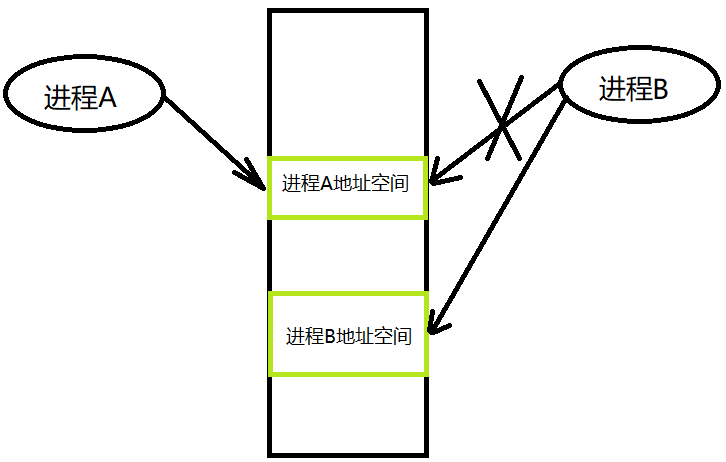
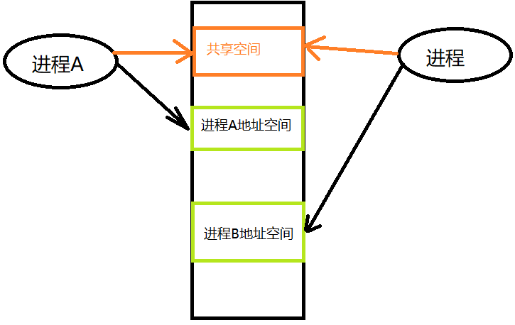

# 2.1 进程

## 2.1.1 进程介绍

程序：是静态的，就是个存放在磁盘里的可执行文件，是一系列的指令集合。

进程：是动态的，是程序的一次执行过程，一个程序可以在一台机子上同时运行 n 个，好比 qq，不运行的话，qq所在的文件目录那些文件代码是程序，点击运行，装载到内存和cpu里就变成了进程，而且可以同时运行多个 qq。

这就体现了并发性和共享性。

### 那操作系统如何区分同一个程序装入内存的多个进程？

当进程被创建时，操作系统会为该进程分配一个唯一的、不重复的编号——PID（Process ID，进程ID）。

操作系统还记录给进程分配了什么资源（内存、IO设备、文件）。同时还记录进程的运行情况（cpu 占用时间、对磁盘读写速率、网络流量使用情况）。

上面这些记录的信息，都被保存在一个数据结构 PCB（Process Control Block）中，也称为进程控制块。

进程映像由三个部分组成：

* 程序段（程序使用）
* 相关数据段（程序使用）
* PCB（操作系统使用）

进程映像是静态的，进程是动态的。

**PCB 是进程存在的唯一标志！**

可以这么理解进程：

进程是程序的一次运行。进程是一个程序及其数据在处理机上顺序执行时所发生的活动。进程是具有独立功能的程序在一个数据集合上运行的过程，它是系统进行资源分配和调度的一个独立单位。

### 进程特性

* **动态性**。进程是程序的一次执行，它有着创建、活动、暂停、终止等过程，具有一定的生命周期，是动态地产生、变化和消亡。
* **并发性**。多个进程实体同时存在内存中，能在一段时间内同时运行。
* **独立性**。指进程实体是一个能独立运行、独立获得资源和独立接受调度的基本单位。凡是未建立PCB的程序，都不能作为一个独立的单位参与运行。
* **异步性**。由于进程的相互制约，使得进程具有执行的间断性，即进程按各自独立的、不可预知的速度向前推进。异步性会导致执行结果的不可再现性，为此操作系统中必须配置相应的同步机制。
* **结构性**。每个进程都配置一个 PCB 对其进行描述。从结构上看，进程实体是由程序段、数据段和PCB三部分组成的。

## 2.1.2 进程的状态与转换

进程在生命周期内，由于系统中各进程之间的相互制约关系及系统的运行环境的变化，使得进程的状态也在不断的发生变化。

* **运行态**。进程正在处理机上运行。在单处理机环境下，每个时刻最多只有一个进程处于运行态。
* **就绪态**。进程获得了除处理机外的一切所需资源，一旦得到处理机，便可立即运行。系统中处于就绪状态的进程可能有多个，通常它们会排队，形成一个队列，称为就绪队列。
* **阻塞态**。进程正在等待某一事件而暂停运行，如等待某资源为可用（不包括处理机）或等待输入/输出完成。即使处理机空闲，该进程也不能运行。
* **创建态**。进程正在被创建，尚未转到就绪态。创建进程通常需要多个步骤：首先申请空白的 PCB，并向 PCB 中填写一些控制和管理进程的信息；然后由系统为该进程分配运行时所必须的资源；足厚把该进程转入就绪态。
* **结束态**。进程正在从系统中消失，可能是进程正常结束或其他原因中断退出运行。进程需要结束运行时，系统首先必须将该进程置为结束态，然后进一步处理资源释放和回收等工作。

这几个状态之间会进行相互转换：

 

| 状态转换           |                                                              |
| ------------------ | ------------------------------------------------------------ |
| 就绪态 ---> 运行态 | 处于就绪态的进程被调度后，获得处理机资源（时间片轮转到了）   |
| 运行态----> 就绪态 | 处于运行态的进程时间片用完了，操作系统夺回处理机；有更高优先级的进程需要处理机。 |
| 运行态----> 阻塞态 | 进程请求某一资源的使用和分配或等待某一事件的发生；进程以系统调用的形式请求操作系统提供服务。 |
| 阻塞态----> 就绪态 | 进程等待的事件（资源）到来，如IO操作结束或中断结束时，中断处理程序必须把相应进程的状态有阻塞态转换为就绪态。 |

从运行态变成阻塞态是主动的行为，从阻塞态变成就绪态是被动的行为。

进程的状态是保存在 PCB的一个叫做 state 变量中。

## 2.1.3 进程控制

进程控制包括，创建新进程（增）、撤销已有进程（删）、实现进程状态转换（改）等功能。

在操作系统中，一般把进程控制用的程序段称为原语，原语的特点是执行期间不允许中断，它是一个不可分割的基本单位。

### 进程的创建

​	允许一个进程创建另一个进程。可以理解为父进程和子进程。子进程可以继承父进程所拥有的资源。当子进程被撤销时，应该将其从父进程那里获得的资源归还给父进程。此外，在撤销父进程时，必须同时撤销其所有的子进程。（归结起来一句话：子承父业，子亡物归父，父亡子必亡）

​	创建一个新进程的过程如下（创建原语）：

① 为新进程分配一个唯一的进程标识号，并申请一个空白的PCB。若 PCB申请失败（PCB个数有限），则创建失败。

② 为进程分配资源，为新进程的程序和数据及用户栈分配必要的内存空间（在PCB中体现）。若资源不足（内存不足），则不是创建失败，而是处于阻塞态，等待内存资源。

③ 初始化PCB，主要包括初始化标志信息、初始化处理机状态信息和初始化处理机控制信息，设置进程优先级。

④ 若进程就绪队列能够接纳新进程，则将新进程插入就绪队列，等待被调度运行。

### 进程的终止

进程的终止原因有：

* 正常结束，表示进程的任务已完成并准备退出运行。
* 异常结束。表示进程在运行时，发生了异常事件，使程序无法运行，如存储区越界、保护错、非法指令、特权指令错、运行超时、算术运算错、IO故障。
* 外界干预。进程应用外界的请求而终止运行，如操作员或操作系统干预、父进程请求和父进程终止。

操作系统终止进程的过程如下（撤销原语）：

① 根据被终止进程的标识符，检索 PCB，从中读出该进程的状态。

② 若被终止进程处于执行状态，立即终止该进程的执行，将处理机资源分配给其他进程

③ 若该进程还有子孙进程，则应将其所有子孙进程终止。

④ 将该进程所拥有的全部资源，或归还给其父进程，或归还给操作系统。

⑤ 将该 PCB 从所在队列中删除。

### 进程的阻塞和唤醒

进程等待的资源还未到达，由系统自动执行阻塞原语，使自己由运行态变为阻塞态。进程的阻塞是进程自身的一种主动的行为，只有处于运行态的进程，才可能将其转为阻塞态。阻塞原语执行过程：

① 找到将要被阻塞进程的标识号对应的 PCB。

② 若该进程为运行态，则保护现场，将其状态转为阻塞态，停止运行。

③ 把该 PCB 插入相应事件（如等待IO设备）的等待队列，将处理机资源调度给其他就绪的进程。

当被阻塞的进程所需的资源有可分配的，由有关进程（如释放资源的进程）调用唤醒原语，将等待该资源的阻塞进程唤醒。唤醒原语执行过程:

① 在该资源的等待队列中找到相应进程的 PCB。

② 将其从等待队列中移出，置其状态位就绪态。

③ 把该 PCB 插入就绪队列，接下来就是等待调度程序调度。

### 进程切换

进程切换是在内核的支持下实现的，任何进程都是在操作系统内核的支持下运行的，是与内核紧密相关的。

进程切换是指处理机从一个进程的运行转到另一个进程上运行，在这个过程中，进程的运行环境产生了实质性的变化。

其过程为：

① 保存处理机上下文，包括程序计数器和其他寄存器。

② 更新 PCB。

③ 把进程的 PCB 移入相应的队列，如就绪、在某事件阻塞队列。

④选择另一个进程执行，更新其 PCB。

⑤更新内存管理的数据结构。

⑥ 恢复处理机上下文。

_与处理机模式切换不同，处理机模式切换时，处理机逻辑上可能还在同一个进程中运行。例子：进程因中断或异常进入核心态运行，运行完毕后回到用户态刚被中断的进程运行，则操作系统只需恢复进程进入内核时所保存的 cpu 现场，而无须改变当前进程的环境信息。如果是进程切换，当前运行进程改变了，当前进程的环境信息也会改变。_

## 2.1.4 进程的组织

进程是一个独立的单位，由三部分组成。

### 进程控制块

进程创建时，操作系统为它创建一个 PCB，该结构之后常驻内存，任意时刻都可以存取，并在进程结束时删除。PCB是进程的存在的唯一标志。

​	进程执行时，系统通过其 PCB 了解进程的现行状态，以便对其进行控制和管理。进程结束时，系统回收 PCB，该进程随之消亡。操作系统通过控制 PCB 表来管理和控制进程

​	当操作系统预调度某个进程运行时，要从该进程的 PCB 中查找其现行的状态及优先级；在调度到某进程后，要根据其 PCB 中所保存的处理机状态信息，设置该进程恢复运行的现场，并根据其 PCB 中的程序和数据的内存开始地址，找到程序和数据，进程在运行过程中，当需要与之合作的进程实现同步、通信或访问文件时，也需要访问 PCB；当进程由于某种原因而暂停运行时，又需要将其断点的处理机环境保存在 PCB 中。

#### PCB 包含的内容

| 进程描述信息 | 进程控制和管理信息 | 资源分配清单 | 处理机相关信息 |
| ------------ | ------------------ | ------------ | -------------- |
| 进程标识符   | 进程当前状态       | 代码段指针   | 通用寄存器     |
| 用户标识符   | 进程优先级         | 数据段指针   | 地址寄存器     |
|              | 代码运行入口地址   | 堆栈段指针   | 控制寄存器     |
|              | 程序的外存地址     | 文件描述符   | 标准寄存器     |
|              | 进入内存的时间     | 键盘         | 状态字         |
|              | 处理机占用时间     | 鼠标         |                |
|              | 信号量使用         |              |                |

### 程序段

能被进程调度程序调度到 cpu 执行的代码段。程序可被多个进程共享。

### 数据段

一个进程的数据段，可以是进程对应的程序加工处理的原始数据，也可以是程序执行时产生的中间或最终结果。

## 2.1.5	进程的通信

PV 操作是低级通信方式，高级通信方式是以较高的效率传输大量数据的通行方式。

### 共享存储

正常来说，每个进程都有自己的地址空间段。一个进程不允许访问另一个进程的地址空间。

  

那怎么实现两个进程之间的通信呢？

**共享存储**可以实现两个进程间的通信！两个进程对操作系统进行系统调用，申请一个**共享空间**，进程 A 和进程 B 通过同步互斥工具（PV），从而对共享空间进行读/写操作实现进程间的信息交换。进程对共享空间的访问必须是互斥的。可以多个进程进行共享空间的读写。

 

_这里的箭头表示访问的意思。_

分两种：基于数据结构的共享；基于存储区的共享。

### 消息传递

在消息传递系统中，进程间的数据交换时以格式化的**消息**为单位的。若通信的进程间不存在可直接访问的共享空间，则必须利用操作系统的消息传递方法实现进程通信。进程通过系统提供的发送信息和接受信息两个原语进行数据交换。

① 直接通信方式。发送进程直接把消息发送个接受进程，并将它挂在接受进程的消息缓冲队列上，接受进程从消息缓冲队列中取得消息。

 

② 间接通信方式。发送进程把消息发送到某个中间实体，接受进程从中间实体取得消息，这种中间实体一般称为**信箱**，这种通信方式又称信箱通信方式。该通信方式广泛应用于计算机网络中，相应的通信系统称为电子邮件系统。

### 管道通信

管道通信是消息传递的一种特殊方式。管道，是指用于连接一个读进程和一个写进程以实现它们之间的通信的一个共享文件，又名 pipe 文件。向管道提供输入的发送进程，以字符流形式将大量的数据送入管道；而接受管道输出的接受进程则从管道中接受数据。为了系统双方的通信，管道机制必须提供三方面的协调能力：互斥、同步、确定对方存在。

linux 管道：

① 限制管道的大小。管道是一个固定大小的缓冲区。在 linux 中，该缓冲区的大小为 4KB，这使得它的大小不像文件那样不加检验地增长。使用单个固定缓冲区也会带来问题，比如在写管道时可能变满，这种情况发生时，随后对管道的 write 调用将默认地被阻塞，等待数据被读取，以便腾出足够的空间供 write 调用写。

② 读进程也可能工作得比写进程快。当所有当前进程数据已经被读取了，管道就变空。当这种情况发生时，一个随后的 read 也被默认地阻塞，等待某些数据被写入，这解决了 read 调用返回文件结束符的问题。

_管道读数据是一次性操作，数据一旦被读取，它就能从管道中被抛弃，释放空间以便写入更多的数据。管道只能采用半双工通信（某一时刻只能单向传输），如果实现两个进程间互动通信，需要两个管道。_

管道还有一个特点，就是写进程会先把缓冲区写满，然后才让读进程读，当缓冲区中还有数据时，写进程不会往缓冲区写入数据。