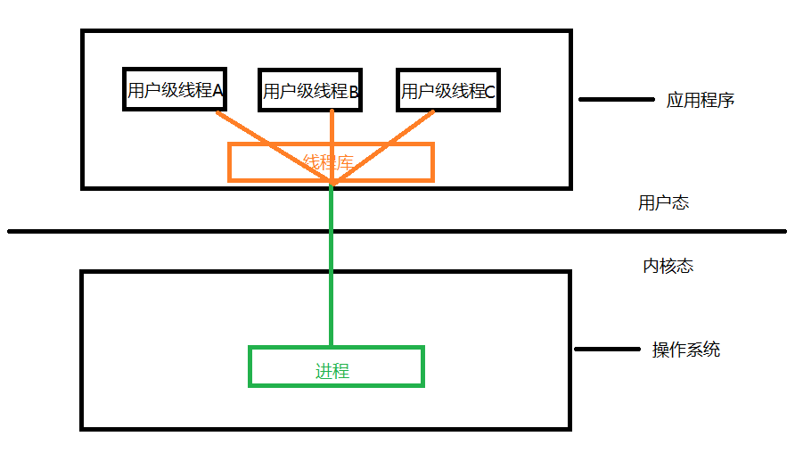
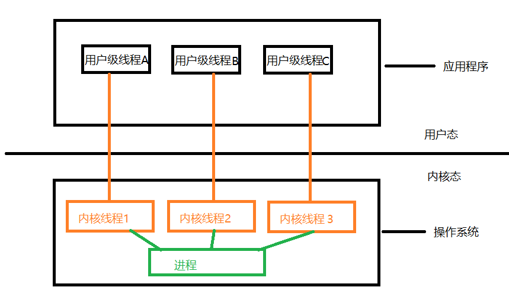
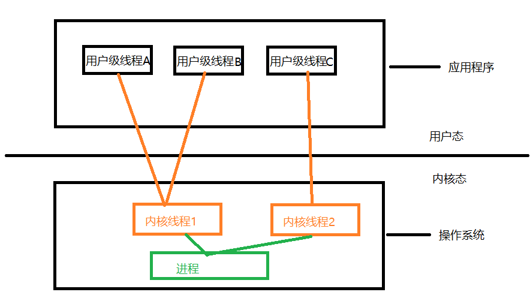

# 2.2 线程

## 2.2.1 基本概念

​	引入进程的目的是**更好地使用多道程序并发执行**，提高资源利用率和系统吞吐量；而引入线程的目的是**减小程序在并发执行时所付出的时空开销，提高操作系统的并发性能**。（可以试想一下，如果没有线程，我们还能用微信一边接通视频通话，一边刷着朋友圈或者和其他好友打字聊天吗？）

​	线程是轻量级进程，它是一个基本的 cpu 执行单元，也是程序执行流的最小单元。

​	线程由线程ID、程序计数器、寄存器集合和堆栈组成。

​	线程是进程中的一个实体，是被系统独立调度和分派的基本单位，线程自己不拥有系统资源，值拥有一点在运行中必不可少的资源，但它可与同属一个进程的其他线程共享进程所拥有的全部资源。一个线程可以创建和撤销另一个线程，同一个进程中的多个线程之间可以**并发**执行。

​	进程只作为除 cpu 外的系统资源的分配单元，而线程作为处理机的分配单元。由于一个进程内部有多个线程，若线程切换发生在同一进程内部，则只需很少的时空开销（因为这些线程共用进程的所有资源）。

## 2.2.2 线程与进程的比较

① **调度**。在传统的操作系统中，拥有资源和独立调度的基本单位都是进程。在引入线程的操作系统中，线程是独立调度的基本单位，进程是拥有资源的基本单位。在同一个进程中，线程切换不会引起进程切换。在不同进程中进行线程切换，如从一个进程内的线程切换到另一个进程中的线程时，会引起进程切换（为什么，因为另一个进程中的线程需要的资源和原先的线程不一样啊）

② **拥有资源**。不论是传统操作系统还是设有线程的操作系统，进程都是拥有资源的基本单位，而线程不拥有系统资源，但线程可以访问其隶属进程的系统资源。如果线程由自己的资源，那么同一个进程的线程切换时，也要切换大量的时空开销，不值得。

③ **并发性**。在引入线程的操作系统中，不仅进程之间可以并发执行，而且多个线程之间也可以并发执行，从而使操作系统具有更好的并发性，提高了系统的吞吐量。

④ **系统开销**。由于创建或撤销进程时，系统都要为之分配或回收资源。因此操作系统付出的开销远大于创建或撤销线程时的开销。进程切换时，涉及当前执行进程 cpu 环境的保存及新调度到 cpu 环境的设置，而线程切换时只需保存和设置少量寄存器内容，开销相对小很多。同一进程内的多个线程共享进程的地址空间，因此这些线程之间的同步和通信非常容易实现，甚至无需操作系统的干预。

⑤ **地址空间和其他资源**。进程的地址空间之间相互独立，同一进程的各线程间共享进程的资源，某进程内的线程对于其他进程不可见。

⑥ **通信方面**。进程间通信需要进程同步和互斥手段的辅助，以保证数据的一致性，而线程间可以直接读/写进程数据段。

## 2.2.3 线程的属性

多线程操作系统把线程作为独立运行的基本单位，此时的进程已不再是一个基本的可执行实体，但它仍具有与执行相关的状态。所谓进程处于<font color='red'>执行</font>状态，实际上是指该进程中某线程正在执行。

线程的属性：

① 线程是一个轻型实体，它不拥有系统资源，但每个线程都应有一个唯一的标识符和一个线程控制块，线程控制块记录了线程执行的寄存器和栈等现场状态。

② 不同的线程可以执行相同的程序，即同一个服务程序被不同的用户调用时，操作系统把它们创建成不同的进程。

③ 同一个进程中的各个线程共享该进程所拥有的资源。

④ 线程是处理机的独立调度单位，多个线程是可以并发执行的。在单 cpu 的计算机系统中，各个线程是交替地占用 cpu；在多个 cpu 的计算机系统中，各线程可同时占用不同的 cpu，若各个 cpu 同时为一个进程内的各线程服务，则可缩短进程的处理时间。

⑤ 一个线程被创建后，便开始了它的生命周期，直至终止。线程在生命周期内会经历阻塞态、就绪态和运行态等各种状态变化。

## 2.2.4 线程的实现方式

线程的实现分为：

* 用户级线程（User-Level Thread, ULT）
* 内核级线程（Kernal_Level Thread, KLT)

内核级线程即内核支持的线程。

### 用户级线程

​	早期的操作系统只支持进程，不支持线程。当时的线程是由线程库实现的。

 

早期的操作系统事实上并没有在支持线程，但是聪明的程序员大师们想到了用线程库来实现，可能看代码更清晰：

```c++
int main()
{
    int flag = 0;
    
    // 让 A,B,C 不断轮流交替执行，但是这是如果某个线程卡住了，其他线程就只能一直等。
    while(condition)
    {
        if(flag == 0)
        	call(ThreadA);
        if(flag == 1)
            call(ThreadB);
         if(flag == 2)
            call(ThreadC);
        
        flag = (flag + 1) % 3;
    }
}
```

操作系统压根不知道用户级线程的存在，只知道轮循调用进程罢了。这时候线程管理由用户管理，线程切换管理也由用户态下线程库管理。但是线程切换不需要从用户态切换到内核态，开销就小些。

### 内核级线程

内核级线程的线程管理由内核完成，应用程序没有进行线程管理的代码，只有一个到内核级线程的编程接口。内核为进程及其内部的每个线程维护上下文信息，调度也在内核基于线程架构的基础上完成。

 

线程调度、切换等工作都由内核负责，因此内核级线程的切换必然要在核心态矮才能完成。

操作系统会为每个内核级线程建立相应的 TCB，通过 TCB 对线程进行管理。“内核级线程” 就是从操作系统内核视觉看到线程的。

相比于用户级线程，同一个进程中的线程被阻塞了，另外的几个并不会因此而阻塞（除非为了资源被阻塞）。同时线程切换会导致用户态切换到内核态，时空开销相对来说比较大。

### 多线程模型

**多对一模型**：上面的用户级线程，就是多对一模型，将多个用户级线程映射到一个内核级线程，线程管理在用户空间完成。

优点：线程管理在用户空间进行，时空开销小。

缺点：一个线程阻塞，整个进程都会被阻塞，多个线程不能并行地运行在多个处理机上。

**一对一模型**： 将每个用户级线程映射到一个内核级线程上。

优点：当一个线程被阻塞后，允许另一个线程继续执行，并发能力强。

缺点：每创建一个用户级线程都需要创建一个内核级线程与其对应，这样创建线程的开销比较大，会影响到应用程序的性能。

**多对多模型**：将 n 个用户级线程映射到 m 个 内核级线程上。n > m

特点：是前两个模型的折中，客服了并发度不高的缺点，也克服了进程用户占用太多内核级线程而开销大的缺点。



如果线程 A 阻塞，线程 B 也可能导致阻塞，这时如果处理好代码，让**内核线程2**去执行线程 B 直到线程 A 恢复顺畅执行后，再交给**内核线程1**执行。

